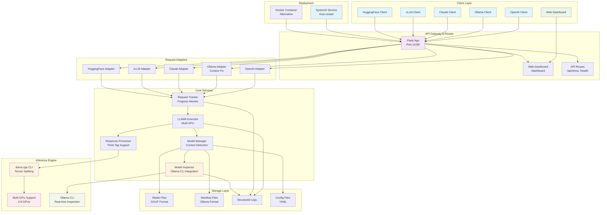
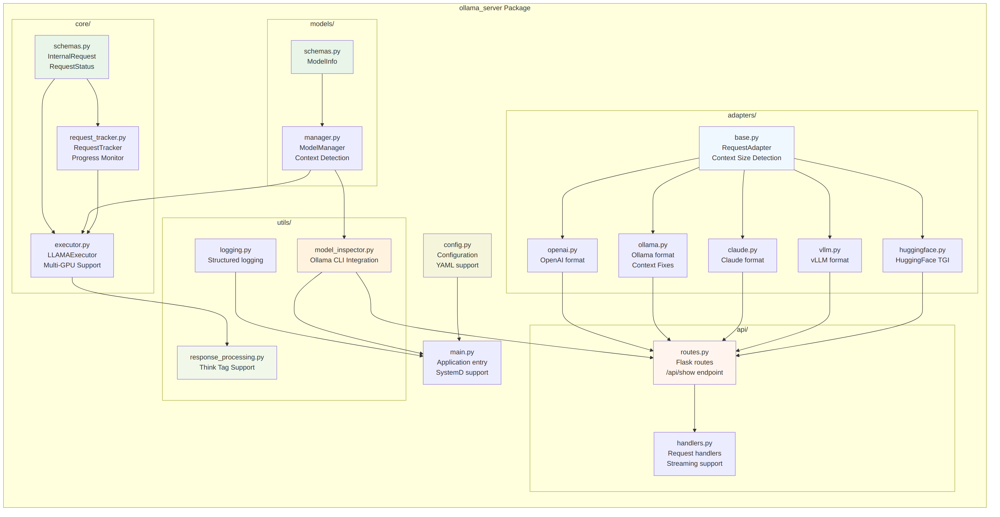
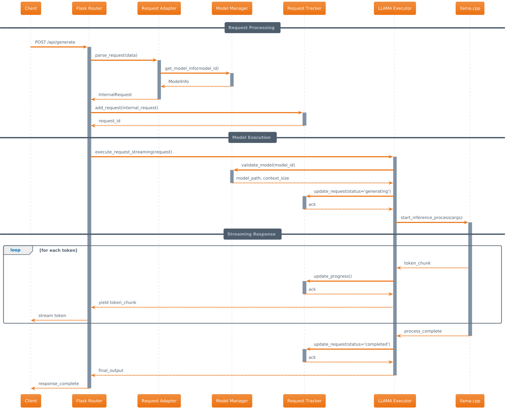
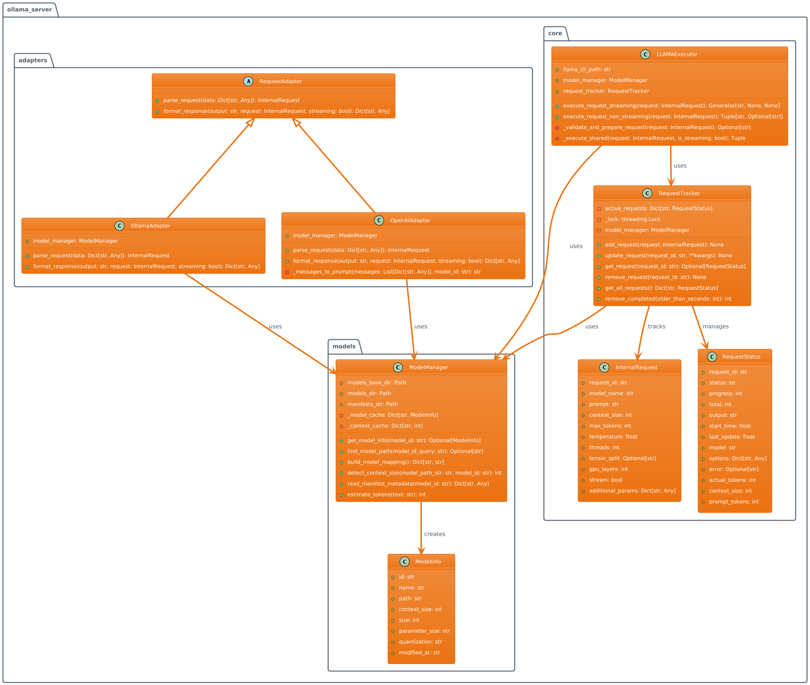
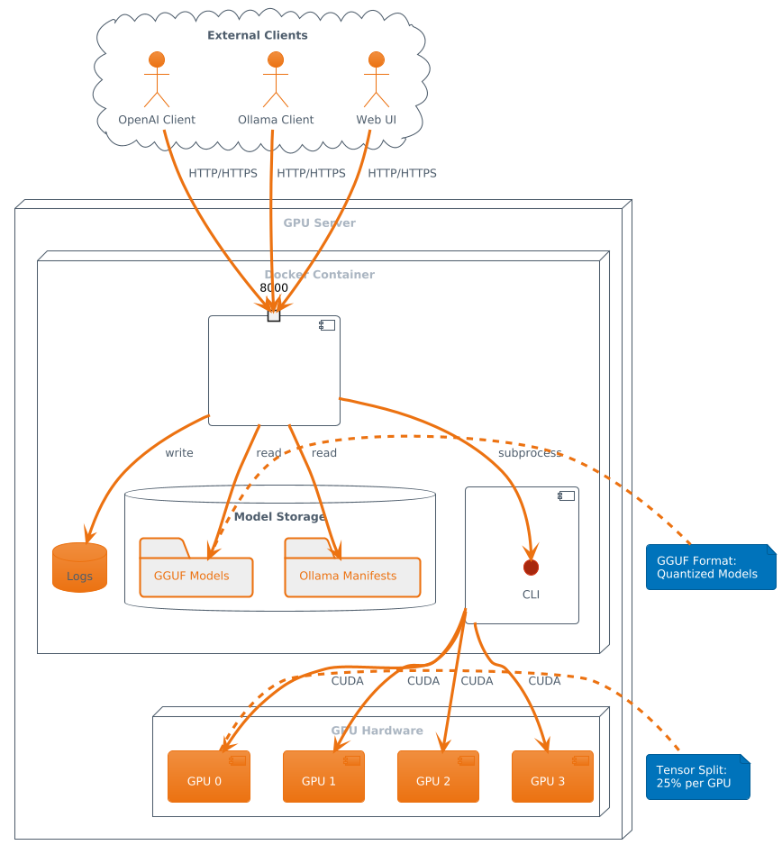

= LLM Inference Service
:toc: left
:toclevels: 3
:sectnums:
:icons: font
:source-highlighter: rouge
:experimental:

== Overview

The LLM Inference Service is a high-performance, multi-API compatible server for serving Large Language Models using llama.cpp as the inference engine. It provides full compatibility with OpenAI, Ollama, Claude, vLLM, and HuggingFace TGI APIs, featuring advanced model management, dynamic context detection, and enterprise-grade deployment options.

== Key Features

* **🔄 Multi-API Compatibility**: Full support for OpenAI, Ollama, Claude, vLLM, and HuggingFace TGI API formats
* **⚡ High Performance**: Built on llama.cpp with GPU acceleration and optimized inference
* **🖥️ Multi-GPU Support**: Advanced tensor splitting across up to 8 GPUs for large models
* **🧠 Intelligent Model Management**: Dynamic model discovery with accurate context size detection
* **📡 Real-time Streaming**: Token-by-token streaming for all API endpoints with progress tracking
* **📊 Advanced Monitoring**: Built-in request tracking, progress monitoring, and performance metrics
* **🐳 Production Deployment**: SystemD service, Docker support, and enterprise logging
* **🔍 Dynamic Model Inspection**: Real-time Ollama integration for accurate model parameters
* **🎯 Think Tag Preservation**: Special handling for reasoning models (phi4-reasoning, etc.)
* **🚀 Auto-scaling Context**: Intelligent context window detection up to 131K+ tokens

== Architecture

The service follows a modular architecture with clear separation of concerns:

.System Architecture

=== Core Components

[cols="1,3"]
|===
|Component |Description

|**API Gateway**
|Flask-based web server with unified routing for all API formats and monitoring dashboard

|**Request Adapters**
|Format-specific adapters for OpenAI, Ollama, Claude, vLLM, and HuggingFace TGI APIs

|**Model Manager**
|Advanced model discovery with dynamic context detection and Ollama manifest integration

|**Model Inspector**
|Real-time Ollama CLI integration for accurate model parameters and context sizes

|**Request Tracker**
|Comprehensive request monitoring with progress tracking and performance metrics

|**LLAMA Executor**
|Optimized llama.cpp execution with multi-GPU support and tensor splitting

|**Response Processor**
|Intelligent response formatting with think tag preservation for reasoning models

|**Storage Layer**
|GGUF model files, Ollama manifests, configuration, and structured logging
|===

== Package Structure

The codebase is organized into a clean, modular structure:

.Package Organization

=== Module Overview

[source,text]
----
ollama_server/
├── core/              # Core functionality
│   ├── schemas.py     # Data structures (InternalRequest, RequestStatus)
│   ├── request_tracker.py  # Request tracking and monitoring
│   └── executor.py    # llama.cpp execution management with GPU support
├── models/            # Model management
│   ├── schemas.py     # Model data structures (ModelInfo)
│   └── manager.py     # Advanced model discovery and context detection
├── adapters/          # API format adapters
│   ├── base.py        # Base adapter with accurate context size detection
│   ├── openai.py      # OpenAI API compatibility
│   ├── ollama.py      # Ollama API compatibility with context fixes
│   ├── claude.py      # Claude/Anthropic API support
│   ├── vllm.py        # vLLM API compatibility
│   └── huggingface.py # HuggingFace TGI API support
├── api/               # Web API layer
│   ├── routes.py      # Comprehensive Flask routes with /api/show endpoint
│   └── handlers.py    # Request handling with streaming and progress
├── utils/             # Utilities
│   ├── logging.py     # Structured logging configuration
│   ├── model_inspector.py  # Real-time Ollama CLI integration
│   └── response_processing.py  # Think tag preservation
├── config.py          # Configuration management
└── main.py            # Application entry point with SystemD support
----

== Request Flow

The service processes requests through a well-defined flow:

.Request Processing Flow
image::images/request_flow.png[Request Flow,800,500]

=== Detailed Sequence

.API Request Sequence Diagram

== Class Diagram

The following diagram shows the relationships between key classes:

.Class Relationships

== Deployment Architecture

.Deployment View

The service supports multiple deployment options for GPU-enabled servers:

* **SystemD Service**: Production-ready service management with auto-restart and logging
* **Container-based**: Docker deployment with GPU device mapping (alternative)
* **Multi-GPU**: Advanced tensor splitting across multiple GPUs (2-8 GPUs supported)
* **Scalable**: Stateless design allows for horizontal scaling
* **Monitoring**: Built-in health checks, request tracking, and web dashboard
* **Enterprise Features**: Structured logging, graceful shutdown, and configuration management

== Installation & Setup

=== Prerequisites

* Python 3.10+
* NVIDIA GPUs with CUDA support (recommended for production)
* Ollama installed and configured (for model inspection)
* SystemD (for service deployment)
* Docker (optional, for containerized deployment)

=== Production Deployment (SystemD)

. **Clone and setup**:
+
[source,bash]
----
git clone https://github.com/your-org/llm-inference-service
cd llm-inference-service
pip install -r requirements.txt
----

. **Install and start service**:
+
[source,bash]
----
# Install user-level SystemD service
./install-user-service.sh

# Start the service
systemctl --user start llm-inference

# Enable auto-start on boot
systemctl --user enable llm-inference
----

. **Monitor service**:
+
[source,bash]
----
# Check service status
./service-status-user.sh

# View logs
journalctl --user -u llm-inference -f

# Access web dashboard
curl http://localhost:11435/dashboard
----

=== Development Mode

. **Quick start for development**:
+
[source,bash]
----
python -m ollama_server.main \
  --model-dir /opt/llm/models/ollama/models \
  --llama-cpp-dir /opt/llm/models/ollama-custom-models/llama.cpp/build \
  --port 11435 \
  --debug
----

. **Test the installation**:
+
[source,bash]
----
# Run test script
python test_context_fix.py

# Test API endpoints
curl http://localhost:11435/health
curl http://localhost:11435/api/models
----

=== Docker Deployment (Alternative)

. **Build and run with Docker**:
+
[source,bash]
----
# Build the container
docker-compose build

# Start the service
docker-compose up -d

# Check logs
docker logs -f llm-inference
----

== Configuration

=== Service Configuration

The service uses a YAML configuration file (`config/service_config.yaml`):

[source,yaml]
----
models_dir: /opt/llm/models/ollama/models/blobs
manifests_dir: /opt/llm/models/ollama/models/manifests/registry.ollama.ai/library
llama_cpp_path: /opt/llm/models/ollama-custom-models/llama.cpp
default_context_size: 131072         # Auto-detected context sizes up to 131K+
default_model: null
tensor_split: '0.25,0.25,0.25,0.25'  # 4-GPU equal split configuration
gpu_layers: 999                       # Offload all layers to GPU
threads: 32                           # CPU threads for inference
batch_size: 512
request_timeout: 1800                 # 30 minutes
log_level: INFO
enable_model_inspection: true         # Dynamic Ollama CLI integration
preserve_think_tags: true             # For reasoning models
----

=== GPU Configuration

For multi-GPU setups, configure tensor splitting:

[source,bash]
----
# Equal split across 4 GPUs
--default-tensor-split "0.25,0.25,0.25,0.25"

# Custom split for different GPU memory sizes
--default-tensor-split "0.4,0.3,0.2,0.1"
----

=== Model Management

Models are stored in Ollama format:

* **Model blobs**: `/models/ollama/models/blobs/sha256-*`
* **Manifests**: `/models/ollama/models/manifests/registry.ollama.ai/library/`

The service automatically detects:

* Model context size from manifests and filenames
* Parameter count and quantization level
* Model family and appropriate defaults

== API Usage

The service now runs on port **11435** by default and provides comprehensive API compatibility.

=== OpenAI Compatible API

[source,bash]
----
curl -X POST http://localhost:11435/api/chat/completions \
  -H "Content-Type: application/json" \
  -d '{
    "model": "llama3.1:8b",
    "messages": [
      {"role": "user", "content": "What is quantum computing?"}
    ],
    "stream": false,
    "temperature": 0.7,
    "max_tokens": 512
  }'
----

=== Ollama Compatible API

[source,bash]
----
# Generate completion
curl -X POST http://localhost:11435/api/generate \
  -H "Content-Type: application/json" \
  -d '{
    "model": "llama3.1:8b",
    "prompt": "Why is the sky blue?",
    "stream": false,
    "options": {
      "temperature": 0.7,
      "num_predict": 512,
      "num_ctx": 131072
    }
  }'

# Chat completion
curl -X POST http://localhost:11435/api/chat \
  -H "Content-Type: application/json" \
  -d '{
    "model": "phi4-reasoning:latest",
    "messages": [
      {"role": "user", "content": "Solve: 2x + 5 = 13"}
    ],
    "stream": false
  }'
----

=== Model Information & Capabilities

[source,bash]
----
# List available models
curl http://localhost:11435/api/models

# Get detailed model capabilities (NEW: with accurate context length!)
curl -X POST http://localhost:11435/api/show \
  -H "Content-Type: application/json" \
  -d '{"name": "llama3.1:8b"}'

# Returns: {"model_info": {"llama.context_length": 131072, ...}}

# Health check and service info
curl http://localhost:11435/health

# Web dashboard for monitoring
curl http://localhost:11435/dashboard
----

=== HuggingFace TGI API

[source,bash]
----
# Generate completion
curl -X POST http://localhost:11435/generate \
  -H "Content-Type: application/json" \
  -d '{
    "inputs": "The future of AI is",
    "parameters": {
      "max_new_tokens": 256,
      "temperature": 0.8
    }
  }'

# Get model info
curl http://localhost:11435/info
----

=== Advanced Features

[source,bash]
----
# Stream with progress tracking
curl -X POST http://localhost:11435/api/generate \
  -H "Content-Type: application/json" \
  -d '{
    "model": "phi4-reasoning:latest",
    "prompt": "Think step by step: What is 127 * 83?",
    "stream": true
  }'

# Monitor request progress
curl http://localhost:11435/api/progress/{request_id}

# Get models with auto-detected context sizes
curl http://localhost:11435/api/models | jq '.models[] | {name, context_size}'
----

== Key Innovations

This service introduces several important innovations for LLM inference:

=== 🔍 Dynamic Model Inspection

* **Real-time Ollama Integration**: Queries the actual Ollama CLI to get precise model parameters
* **Accurate Context Detection**: Automatically detects context windows up to 131K+ tokens
* **No More Artificial Limits**: Eliminates the common 4K context restriction found in other services
* **Architecture-Aware**: Provides model-specific metadata (llama.context_length, phi.context_length, etc.)

=== 🎯 Reasoning Model Support

* **Think Tag Preservation**: Maintains `<think>...</think>` tags for phi4-reasoning and similar models
* **Format-Specific Handling**: Preserves reasoning content in Ollama format, strips for OpenAI format
* **Improved Transparency**: Allows users to see the model's reasoning process when desired

=== 📊 Enterprise Monitoring

* **Real-time Dashboard**: Web-based monitoring at `/dashboard` with auto-refresh
* **Request Progress Tracking**: Monitor token generation progress in real-time
* **Performance Metrics**: Token generation rates, latency, and throughput statistics
* **Health Monitoring**: Comprehensive system health checks and error reporting

=== 🔧 Production Deployment

* **SystemD Integration**: Proper service management with auto-restart and logging
* **Zero-Downtime Updates**: Graceful shutdown and startup procedures
* **Multi-GPU Optimization**: Advanced tensor splitting across 2-8 GPUs
* **Configuration Management**: Centralized YAML configuration with hot-reload support

== Development

=== Setting Up Development Environment

. **Install development dependencies**:
+
[source,bash]
----
pip install -r requirements-dev.txt
npm install  # For diagram generation tools
----

. **Run tests**:
+
[source,bash]
----
python -m pytest tests/
----

. **Generate documentation**:
+
[source,bash]
----
# Generate architecture diagrams
npx mmdc -i images/architecture.mmd -o images/architecture.png
java -jar plantuml.jar -tpng images/class_diagram.puml
----

=== Code Style

The project follows these conventions:

* **Python**: PEP 8 with 100-character line limit
* **Imports**: Organized using isort
* **Type hints**: Required for all public interfaces
* **Documentation**: Docstrings for all classes and public methods

=== Contributing

. Fork the repository
. Create a feature branch
. Make your changes with appropriate tests
. Ensure all tests pass
. Submit a pull request

== Performance & Optimization

=== GPU Memory Management

The service optimizes GPU memory usage through:

* **Tensor splitting**: Distributes model layers across multiple GPUs
* **Dynamic offloading**: Adjusts GPU layer count based on available memory
* **Context window management**: Automatically detects and enforces model limits

=== Monitoring

Built-in monitoring includes:

* **Request tracking**: Active request status and progress
* **Performance metrics**: Token generation rates and latency
* **Error reporting**: Detailed error logs and status codes
* **Health checks**: System status and model availability

=== Scaling Considerations

For high-throughput deployments:

* Use multiple service instances behind a load balancer
* Consider model-specific routing for optimal GPU utilization
* Implement request queuing for burst traffic handling
* Monitor GPU utilization and scale accordingly

== Troubleshooting

=== Common Issues

[cols="1,2,2"]
|===
|Issue |Cause |Solution

|**Model not found**
|Incorrect model path or manifest format
|Check model directory structure and manifest files

|**GPU out of memory**
|Model too large for available GPU memory
|Adjust tensor split or reduce context size

|**Slow inference**
|CPU-only execution or suboptimal configuration
|Verify GPU drivers and tensor split configuration

|**API compatibility**
|Missing or incorrect request parameters
|Check API documentation for required fields
|===

=== Debug Mode

Enable debug logging for detailed troubleshooting:

[source,bash]
----
python ollama_server/main.py --debug
----

=== Log Analysis

Application logs are stored in `/logs/server.log` with structured format:

[source,text]
----
2025-06-06 14:32:15,123 - INFO - [MainThread] - ModelManager - Mapped model phi-4:latest to /models/blobs/sha256-abc123
2025-06-06 14:32:16,456 - INFO - [RequestThread-1] - LLAMAExecutor - [req-uuid] Streaming completed successfully
----

== License

Licensed under the Apache License, Version 2.0 (the "License");
you may not use this file except in compliance with the License.
You may obtain a copy of the License at

    http://www.apache.org/licenses/LICENSE-2.0

Unless required by applicable law or agreed to in writing, software
distributed under the License is distributed on an "AS IS" BASIS,
WITHOUT WARRANTIES OR CONDITIONS OF ANY KIND, either express or implied.
See the License for the specific language governing permissions and
limitations under the License.

=== Third-Party Licenses

This project builds upon and includes code from:

* **llama.cpp**: MIT License - High-performance LLM inference engine
* **Flask**: BSD License - Web framework
* **Ollama**: MIT License - Model format and API design inspiration

See the `NOTICE` file for complete license information and attributions.

== Support

For support and questions:

* **Issues**: Create an issue in the project repository
* **Documentation**: Check this README and inline code documentation
* **Community**: Join the discussion in project forums

== Acknowledgments

This project builds upon the excellent work of:

* **llama.cpp**: High-performance LLM inference engine
* **Ollama**: Model format and API design inspiration  
* **OpenAI**: API compatibility standards
* **Flask**: Web framework foundation