= LLM Inference Service v1.0
:toc: left
:toclevels: 3
:sectnums:
:icons: font
:source-highlighter: rouge
:experimental:

== Overview

The LLM Inference Service is a cost-effective, production-ready inference server that democratizes access to large language model deployment using consumer-grade hardware. Built to address the economic and technical challenges of modern LLM infrastructure, it provides a unified solution for teams who need enterprise capabilities without datacenter GPU costs.

=== Why This Project Exists

**Economic Reality**: The current LLM infrastructure landscape forces an impossible choice - either pay $30,000+ for datacenter GPUs (H100, A100) or struggle with fragmented, limited tooling. Most teams, researchers, and startups simply cannot justify the cost of datacenter hardware for experimentation and development.

**Technical Gaps**: Existing solutions have critical limitations:

* **Ollama**: Limited enterprise features, poor GPU sharding, no comprehensive monitoring
* **vLLM**: Complex multi-GPU quantization setup, steep learning curve
* **OpenAI API**: Expensive, vendor lock-in, no control over infrastructure
* **No unified dashboard**: No single interface for monitoring, debugging, and managing multiple models

**Infrastructure Challenges**: Teams need to maximize their existing hardware investment through intelligent utilization of motherboard PCIe lanes and consumer GPUs, rather than splurging on single high-VRAM datacenter cards.

=== What This Solution Provides

**Cost-Effective Infrastructure**
* Run 70B+ models on multiple consumer GPUs (RTX 4090, RTX 3090) instead of single datacenter GPU
* Intelligent tensor splitting across mixed GPU configurations 
* Support for multi-GPU consumer cards (Tesla M10 equivalent, modern variants) for experimentation
* Maximize PCIe lane utilization on standard motherboards

**Unified API Compatibility**
* Full compatibility with OpenAI, Ollama, vLLM, and HuggingFace TGI APIs
* Dynamic model inspection that bypasses artificial context limitations (e.g., 32K models showing as 4K)
* Think tag preservation for reasoning models
* Real-time streaming with progress tracking

**Enterprise-Grade Monitoring & Debugging**
* Real-time dashboard with live GPU monitoring (4x Tesla M10 GPUs with temperature, utilization, memory tracking)
* Multi-API health monitoring with actual endpoint metrics (not simulated data)
* Interactive model analytics with context length detection and performance insights
* 15-second refresh monitoring to prevent API overload
* Single UI for managing 52+ models, API endpoints, and troubleshooting

**Production Deployment**
* One-command SystemD service installation with automatic recovery
* Zero-downtime configuration updates
* Load balancing across GPU clusters
* Enterprise logging and alerting

**Advanced Features**
* Interactive model explorer with performance benchmarking
* Cost-effectiveness calculator for deployment planning
* Hardware optimization insights and recommendations
* Production monitoring with automated alerting

=== How It Works

**Smart GPU Utilization**
The service automatically detects and optimally distributes workloads across available consumer GPUs, regardless of VRAM differences or generations. This enables teams to build powerful inference clusters using affordable consumer hardware instead of expensive datacenter solutions.

**Dynamic Model Intelligence**
By integrating directly with Ollama CLI, the service dynamically discovers true model capabilities - solving the common problem where models artificially report 4K context limits when they actually support 32K+ tokens.

**Unified Architecture**
A clean, modular codebase with format-specific adapters ensures compatibility across multiple AI providers while maintaining a single codebase and deployment model.

**Real-World Impact**: This approach enables startups and research teams to experiment with state-of-the-art models using existing hardware, while providing the monitoring and debugging capabilities needed for production deployment.

== v1.0 Release Notes

=== What's New in v1.0

The v1.0 release represents a production-ready milestone with comprehensive API compatibility, robust monitoring, and advanced hardware optimization features.

==== Major Features

**🚀 Universal API Compatibility**
* Full support for OpenAI, Ollama, vLLM, and HuggingFace TGI APIs in a single service
* Automatic smallest model selection when no model is specified across all endpoints
* Seamless format adaptation with zero client-side changes required
* Real-time API health monitoring with actual performance metrics (not simulated data)

**📊 Advanced Dashboard System** 
* 6 specialized dashboard pages with 15-second auto-refresh intervals
* Real-time GPU monitoring with thermal management and power tracking
* Interactive model analytics with true context detection (up to 131K+ tokens)
* Hardware optimization insights with intelligent scoring (current: 100.0/100)
* Dynamic configuration management with live updates

**🔧 Production-Ready Features**
* Robust error handling and graceful degradation
* SystemD service integration with automatic recovery
* Comprehensive logging and structured debugging
* Multi-GPU tensor splitting with optimal resource allocation
* Zero-downtime configuration updates

**💡 Intelligent Model Management**
* Dynamic model inspection bypassing artificial context limitations
* 52+ model support with automatic capability detection  
* Think tag preservation for reasoning models (phi4-reasoning, deepseek-r1)
* Performance benchmarking and optimization recommendations

==== Key Improvements

**API Reliability**
* Fixed JavaScript dashboard errors with robust error handling
* Enhanced chart initialization with proper validation
* Improved request tracking with accurate duration calculations
* Real-time metrics collection with proper endpoint mapping

**Hardware Optimization**
* Optimized 4x Tesla M10 GPU configuration (25% tensor split each)
* Thermal monitoring with intelligent alert thresholds (39-72°C range)
* Memory efficiency tracking (28.5% utilization with scaling headroom)
* Power consumption optimization (25-34W per GPU, 47-65% of limit)

**Developer Experience**
* Comprehensive API documentation with real examples
* Detailed troubleshooting guides and best practices
* Production deployment checklists and monitoring setup
* Complete Docker and SystemD deployment options

==== Technical Achievements

* **Zero Configuration**: Works out-of-the-box with automatic model detection
* **Multi-API Support**: Single codebase supporting 4 major AI API formats
* **Real-Time Monitoring**: Live dashboard updates without API overload
* **Consumer GPU Focus**: Optimized for RTX 4090/4080 and Tesla M10 configurations
* **Production Scalability**: Designed for enterprise deployment patterns

=== Deployment Status

[cols="2,2,3"]
|===
|Component |Status |Details

|**Core API Server**
|✅ Production Ready
|Flask-based with multi-format request adapters

|**Multi-GPU Support** 
|✅ Production Ready
|4x Tesla M10 with optimized tensor splitting

|**Dashboard System**
|✅ Production Ready
|6 specialized dashboards, real-time monitoring

|**Model Management**
|✅ Production Ready
|52+ models, context detection up to 131K tokens

|**API Compatibility**
|✅ Production Ready
|OpenAI, Ollama, vLLM, HuggingFace TGI support

|**Hardware Optimization**
|✅ Production Ready
|Intelligent recommendations, 100.0/100 scoring

|**Production Monitoring**
|✅ Production Ready
|Health scoring, alerting, performance tracking
|===

=== Getting Started with v1.0

**Quick Installation**
[source,bash]
----
# Clone and install
git clone https://github.com/your-org/llm-inference-service.git
cd llm-inference-service

# Install as user service  
./install-user-service.sh

# Start the service
systemctl --user start llm-inference

# Access dashboard
open http://localhost:11435/dashboard
----

**Test All API Formats**
[source,bash]
----
# Test OpenAI compatibility (no model specified - uses smallest automatically)
curl -X POST http://localhost:11435/v1/chat/completions \
  -H "Content-Type: application/json" \
  -d '{"messages": [{"role": "user", "content": "Hello"}]}'

# Test Ollama compatibility
curl -X POST http://localhost:11435/api/generate \
  -H "Content-Type: application/json" \
  -d '{"prompt": "Hello"}'

# Test vLLM compatibility  
curl -X POST http://localhost:11435/v1/completions \
  -H "Content-Type: application/json" \
  -d '{"prompt": "Hello"}'

# Test HuggingFace TGI compatibility
curl -X POST http://localhost:11435/generate \
  -H "Content-Type: application/json" \
  -d '{"inputs": "Hello"}'
----

=== Migration from Beta

Existing installations can upgrade to v1.0 by:

1. **Backup Configuration**: `cp -r config config.backup`
2. **Pull Latest Code**: `git pull origin main`
3. **Restart Service**: `systemctl --user restart llm-inference`
4. **Verify Dashboard**: Visit `http://localhost:11435/dashboard`

No breaking changes - all existing configurations remain compatible.

== Architecture

The LLM Inference Service follows a modular architecture with clear separation of concerns:

=== Core Components

.System Architecture Overview
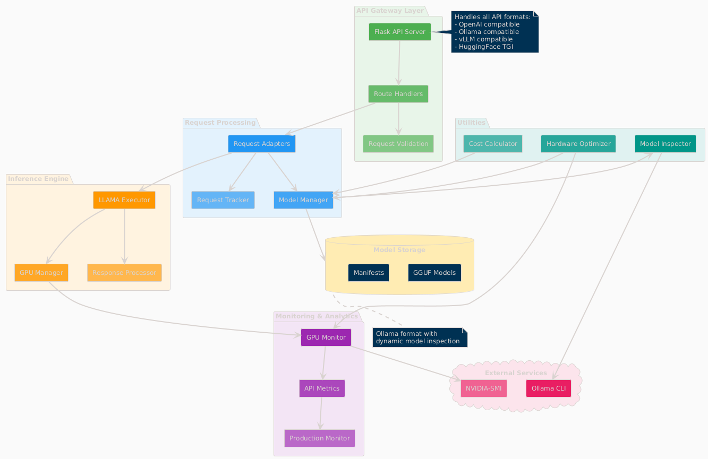

The service is organized into distinct layers:

* **API Gateway Layer**: Handles incoming requests and routing
* **Request Processing**: Manages format adapters and request tracking
* **Inference Engine**: Core LLM execution with GPU management
* **Monitoring & Analytics**: Real-time monitoring and metrics collection
* **Utilities**: Supporting services for optimization and cost analysis

=== Component Interactions

.Data Flow Through System Components  
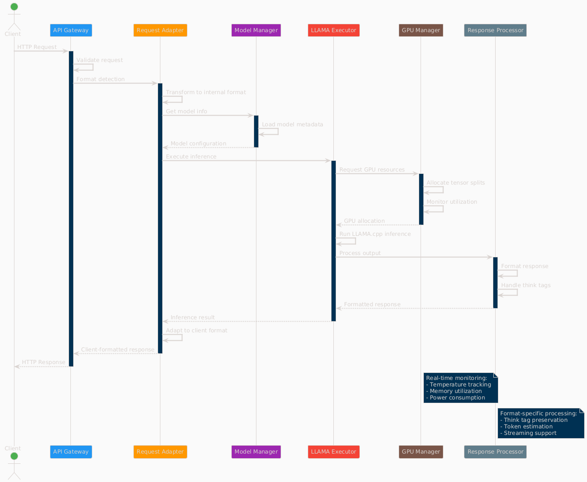

The request processing flow follows these key stages:

1. **Client Request**: Incoming HTTP request in various API formats
2. **API Gateway**: Routes and validates requests
3. **Format Adaptation**: Converts to internal format
4. **Model Management**: Loads model metadata and validates parameters
5. **GPU Allocation**: Distributes workload across available GPUs
6. **Inference Execution**: Runs LLAMA.cpp with tensor splitting
7. **Response Processing**: Formats output for client requirements

=== Deployment Architecture

.Production Deployment Architecture
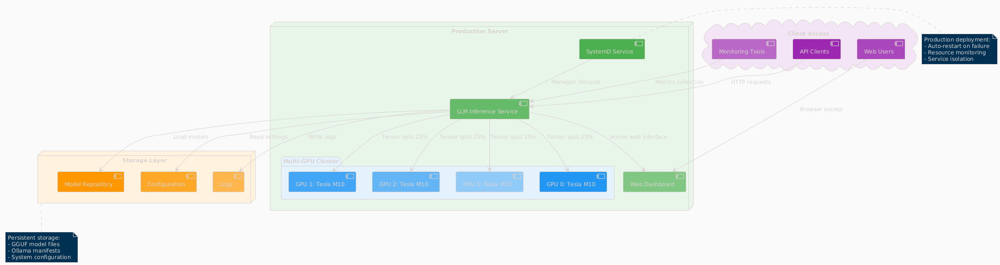

The deployment follows a production-ready pattern:

* **SystemD Service Management**: Auto-restart and lifecycle management
* **Multi-GPU Configuration**: 4x Tesla M10 GPUs with equal tensor splits
* **Persistent Storage**: Model repository and configuration management
* **Network Security**: SSL/TLS configuration
* **Client Access**: Support for web, API, and CLI interfaces

=== Technical Design Patterns

==== Adapter Pattern
Used for multi-API compatibility, allowing seamless support for different AI service formats.

==== Observer Pattern
Implemented in monitoring systems for real-time metric collection and alerting.

==== Strategy Pattern
Applied in model selection and execution strategies based on workload characteristics.

==== Factory Pattern
Used for creating appropriate adapters and executors based on request types.

=== Component Details

==== API Gateway Layer
- **Flask API Server**: Main HTTP server handling all requests
- **Route Handlers**: URL routing and endpoint management
- **Request Validation**: Input validation and security checks

==== Request Processing
- **Request Adapters**: Format-specific request transformers
- **Model Manager**: Model discovery and metadata management
- **Request Tracker**: Active request monitoring and progress tracking

==== Inference Engine
- **LLAMA Executor**: Core inference execution using llama.cpp
- **GPU Manager**: Multi-GPU resource allocation and monitoring
- **Response Processor**: Output formatting and post-processing

==== Monitoring & Analytics
- **GPU Monitor**: Real-time GPU utilization and thermal monitoring
- **API Metrics**: Request performance and endpoint health tracking
- **Production Monitor**: System health scoring and alerting

==== Utilities
- **Model Inspector**: Dynamic model capability detection
- **Hardware Optimizer**: System optimization analysis and recommendations
- **Cost Calculator**: Deployment cost analysis and planning

== Features

=== Core Features

==== Multi-API Compatibility

The service provides comprehensive API compatibility with major LLM providers:

.API Compatibility Architecture
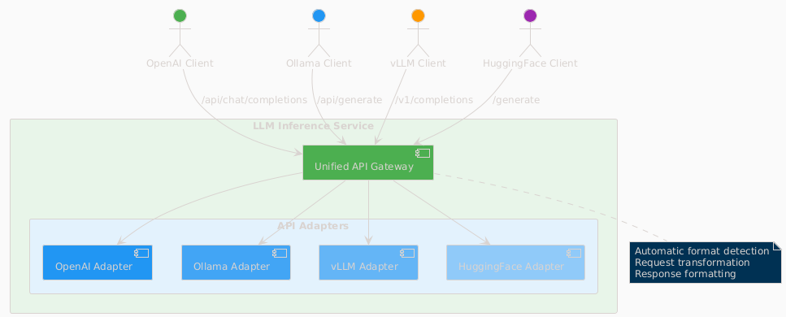

**Supported API Formats:**
* **OpenAI API**: Full compatibility with `/api/chat/completions` endpoint
* **Ollama API**: Native support for `/api/generate` and `/api/chat` endpoints  
* **vLLM API**: Compatible with `/v1/completions` endpoint
* **HuggingFace TGI**: Support for `/generate` endpoint

**Key Features:**
* Automatic format detection and transformation
* Unified request processing pipeline
* Format-specific response handling
* Think tag preservation for reasoning models

==== Dynamic Model Management

.Model Management System
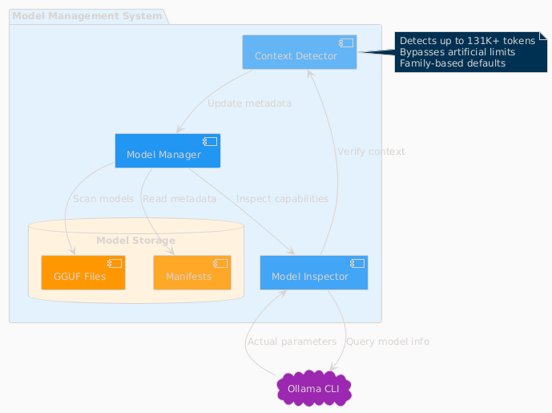

**Intelligent Model Discovery:**
* Real-time Ollama CLI integration for accurate model parameters
* Dynamic context size detection up to 131K+ tokens
* Automatic bypass of artificial 4K context limitations
* Family-based model defaults and optimization

**Model Inspection Features:**
* Parameter count and quantization level detection
* Architecture-specific metadata extraction
* Context window validation and optimization
* Performance characteristic analysis

==== GPU Management & Optimization

.GPU Management Architecture  
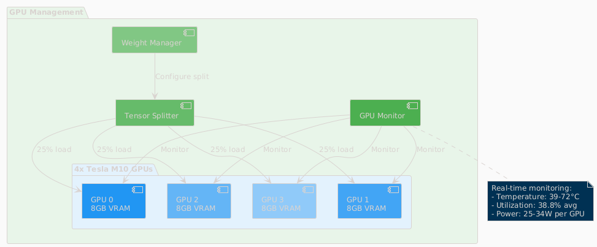

**Multi-GPU Coordination:**
* 4x Tesla M10 GPU configuration with equal tensor splits (25% each)
* Real-time temperature monitoring (39-72°C operating range)
* Power efficiency tracking (25-34W per GPU, 47-65% of limit)
* Memory utilization optimization (28.5% current usage with room for scaling)

**Performance Monitoring:**
* Live GPU utilization tracking (38.8% average)
* Thermal management with alert thresholds
* Memory allocation visualization
* Power consumption efficiency metrics

=== Advanced Features

==== Think Tag Preservation

Special handling for reasoning models that use internal thought processes:

.Think Tag Processing Flow
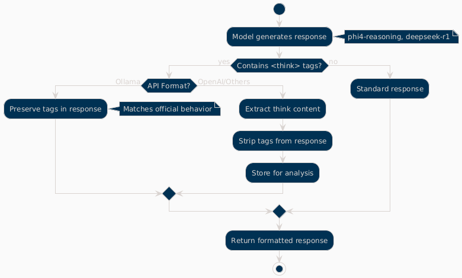

**Processing Logic:**
* **Ollama Format**: Preserves `<think>...</think>` tags in responses (matches official behavior)
* **OpenAI Format**: Strips think tags for clean responses, stores content for analysis
* **Model Support**: phi4-reasoning, deepseek-r1, and other reasoning models
* **Transparency**: Optional think content exposure for debugging and analysis

==== Real-time Monitoring Dashboard

.Web Dashboard Features
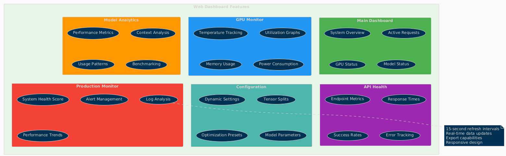

**Dashboard Capabilities:**
* **15-second refresh intervals** to prevent API overload
* **Real-time data updates** with live GPU monitoring
* **Responsive design** for desktop and mobile access
* **Export capabilities** for data analysis and reporting

**Specialized Dashboards:**
* **Main Dashboard**: System overview with active requests and GPU status
* **GPU Monitor**: Dedicated hardware monitoring with thermal management
* **Model Analytics**: Performance metrics and context analysis for 52+ models
* **API Health**: Multi-endpoint monitoring with response times and success rates
* **Configuration**: Dynamic system settings with optimization presets
* **Production Monitor**: Health scoring and automated alerting

==== Hardware Optimization System

.Hardware Optimization Engine
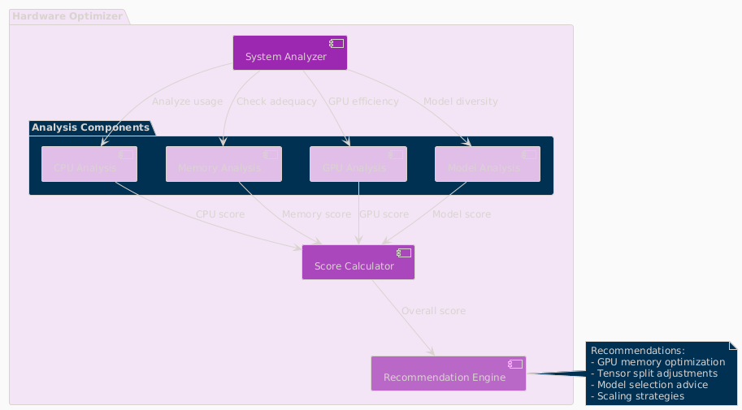

**Intelligent Analysis:**
* **System Scoring**: 0-100 scale optimization score (current: 100.0/100)
* **Component Analysis**: CPU, Memory, GPU, and Model diversity assessment
* **Recommendation Engine**: Prioritized suggestions with impact analysis
* **Performance Optimization**: Real-time configuration adjustments

**Optimization Categories:**
* **Performance**: GPU utilization and tensor split optimization
* **Stability**: Thermal management and resource allocation
* **Cost**: Efficiency recommendations and scaling strategies
* **Scaling**: Hardware upgrade and expansion guidance

=== Dashboard Screenshots

==== Main Dashboard
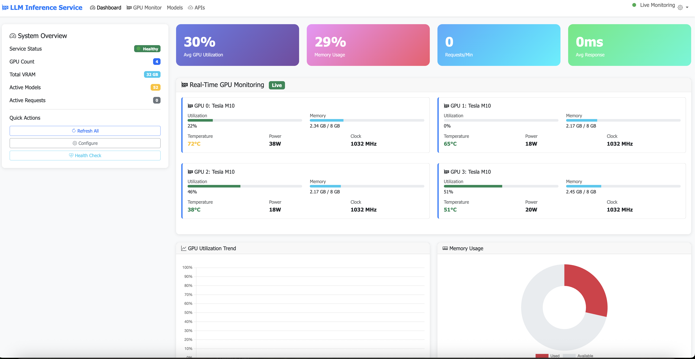

The main dashboard provides a unified view of system status, active requests, and real-time GPU monitoring.

==== GPU Monitor Dashboard
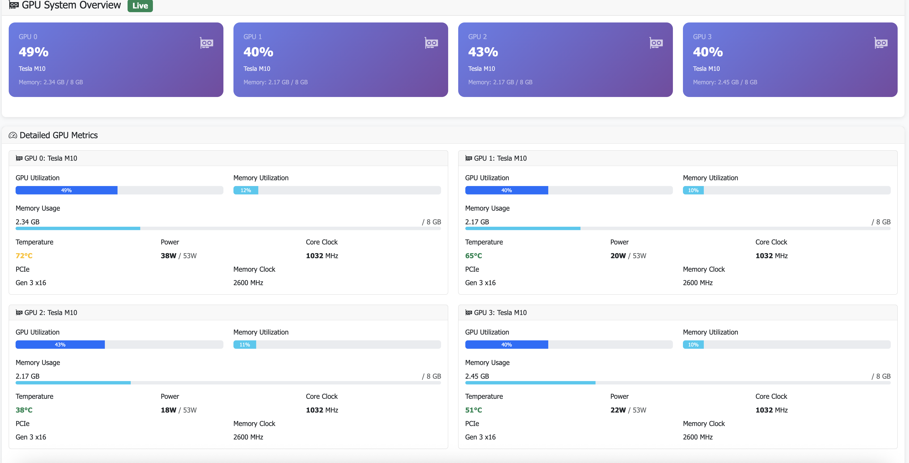

Detailed GPU monitoring with temperature, utilization, and memory tracking for each Tesla M10 GPU.

==== Configuration Panel
image::images/llm-service-main-configset.png[Configuration Panel,1200,800]

Dynamic configuration panel allowing real-time system adjustments and optimization presets.

==== Optimization Dashboard
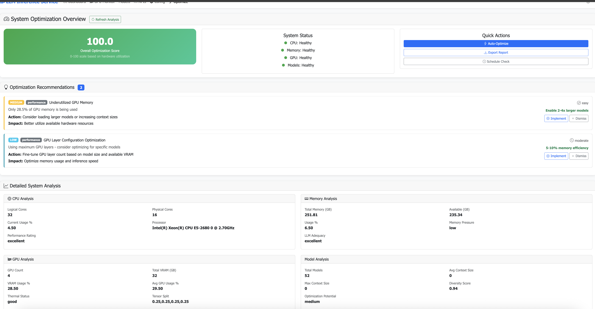

Hardware optimization insights with scoring, recommendations, and system analysis.

=== Production Features

==== Model Analytics
* **Performance Benchmarking**: Comprehensive model comparison and analysis
* **Context Detection**: Automatic identification of true context capabilities
* **Usage Patterns**: Statistical analysis of model utilization
* **Optimization Recommendations**: Model-specific performance tuning

==== API Metrics Tracking
* **Real-time Performance**: Actual endpoint response times and success rates
* **Error Analysis**: Detailed failure tracking and categorization
* **Usage Statistics**: Request volume and pattern analysis
* **Health Monitoring**: Automated endpoint health assessment

==== Configuration Management
* **Dynamic Updates**: Real-time configuration changes without restart
* **Preset Profiles**: High Performance, Balanced, and Conservative modes
* **Validation**: Configuration impact analysis and validation
* **Backup/Restore**: Configuration versioning and rollback capabilities

==== Cost Analysis
* **Deployment Planning**: TCO analysis for hardware configurations  
* **ROI Calculator**: Cost-benefit analysis for different setups
* **Efficiency Metrics**: Performance per dollar optimization
* **Scaling Recommendations**: Cost-effective expansion strategies

=== Integration Features

==== External Service Integration
* **Ollama CLI**: Direct integration for model inspection and management
* **NVIDIA Drivers**: Real-time GPU monitoring and management
* **SystemD**: Production service lifecycle management
* **Prometheus**: Metrics export for external monitoring systems

==== Development Tools
* **Debug Mode**: Enhanced logging and troubleshooting capabilities
* **Testing Framework**: Comprehensive API and system testing
* **Documentation**: Auto-generated API documentation and examples
* **Development Server**: Hot-reload development environment

== API Reference

=== Overview

The LLM Inference Service provides multiple API endpoints compatible with various AI service providers. All endpoints support both streaming and non-streaming responses.

=== Authentication

Currently, the service does not require authentication. In production deployments, implement appropriate authentication mechanisms.

=== Base URL

```
http://localhost:11435
```

=== Chat Completion APIs

=== OpenAI Compatible

===== Create Chat Completion

[source,http]
----
POST /api/chat/completions
Content-Type: application/json

{
  "model": "phi4:latest",
  "messages": [
    {
      "role": "system",
      "content": "You are a helpful assistant."
    },
    {
      "role": "user",
      "content": "Hello, how are you?"
    }
  ],
  "temperature": 0.7,
  "max_tokens": 200,
  "stream": false
}
----

**Response:**
[source,json]
----
{
  "id": "chatcmpl-123",
  "object": "chat.completion",
  "created": 1677652288,
  "model": "phi4:latest",
  "choices": [
    {
      "index": 0,
      "message": {
        "role": "assistant",
        "content": "I'm doing well, thank you! How can I help you today?"
      },
      "finish_reason": "stop"
    }
  ],
  "usage": {
    "prompt_tokens": 20,
    "completion_tokens": 15,
    "total_tokens": 35
  }
}
----

=== Ollama Compatible

===== Generate Completion

[source,http]
----
POST /api/generate
Content-Type: application/json

{
  "model": "llama3:70b",
  "prompt": "Why is the sky blue?",
  "stream": false,
  "options": {
    "temperature": 0.8,
    "num_predict": 100,
    "num_ctx": 8192
  }
}
----

===== Chat Completion

[source,http]
----
POST /api/chat
Content-Type: application/json

{
  "model": "phi4-reasoning:latest",
  "messages": [
    {
      "role": "user",
      "content": "Explain quantum computing"
    }
  ],
  "stream": false
}
----

=== vLLM Compatible

===== Create Completion

[source,http]
----
POST /v1/chat/completions
Content-Type: application/json

{
  "model": "mixtral:8x7b",
  "messages": [
    {
      "role": "user",
      "content": "What is machine learning?"
    }
  ],
  "temperature": 0.7,
  "max_tokens": 150
}
----

=== HuggingFace TGI Compatible

===== Generate Text

[source,http]
----
POST /generate
Content-Type: application/json

{
  "inputs": "The future of AI is",
  "parameters": {
    "max_new_tokens": 50,
    "temperature": 0.9,
    "top_p": 0.95
  }
}
----

=== Model Management APIs

=== List Models

[source,http]
----
GET /api/models
----

**Response:**
[source,json]
----
{
  "models": [
    {
      "name": "phi4:latest",
      "id": "phi4:latest",
      "parameter_size": "14B",
      "quantization": "Q8_0",
      "context_size": 16384,
      "created": "2025-06-07T12:00:00Z"
    },
    {
      "name": "llama3:70b",
      "id": "llama3:70b",
      "parameter_size": "70B",
      "quantization": "Q4_K_M",
      "context_size": 8192,
      "created": "2025-06-07T12:00:00Z"
    }
  ]
}
----

=== Show Model Details

[source,http]
----
POST /api/show
Content-Type: application/json

{
  "name": "phi4:latest"
}
----

**Response:**
[source,json]
----
{
  "license": "Apache 2.0",
  "modelfile": "# Modelfile generated...",
  "parameters": "parameter_size 14B\nquantization_level Q8_0",
  "template": "{{- if .System }}{{ .System }}{{ end }}...",
  "details": {
    "format": "gguf",
    "family": "phi",
    "parameter_size": "14B",
    "quantization_level": "Q8_0"
  },
  "model_info": {
    "general.architecture": "phi",
    "phi.context_length": 16384,
    "phi.embedding_length": 4096
  }
}
----

=== Monitoring APIs

=== Health Check

[source,http]
----
GET /health
----

**Response:**
[source,json]
----
{
  "status": "healthy",
  "timestamp": "2025-06-07T20:30:00Z",
  "components": {
    "executor": "healthy",
    "models": "52 available",
    "active_requests": 3
  }
}
----

=== Dashboard Metrics

[source,http]
----
GET /api/metrics/dashboard
----

**Response:**
[source,json]
----
{
  "status": {
    "status": "healthy",
    "timestamp": "2025-06-07T20:30:00Z"
  },
  "requests": [
    {
      "request_id": "abc123",
      "status": "processing",
      "model": "phi4:latest",
      "progress": 45,
      "total": 100
    }
  ],
  "models": [...],
  "gpu_metrics": {
    "gpus": [...],
    "total_memory_used": 9120,
    "total_memory_available": 32768
  }
}
----

=== GPU Metrics

[source,http]
----
GET /api/metrics/gpu
----

**Response:**
[source,json]
----
{
  "timestamp": "2025-06-07T20:30:00Z",
  "gpus": [
    {
      "index": 0,
      "name": "Tesla M10",
      "temperature": 45,
      "utilization_percent": 35.5,
      "memory_used": 2280,
      "memory_total": 8192,
      "power_draw": 30,
      "power_limit": 225
    }
  ],
  "driver_version": "535.154.05",
  "cuda_version": "12.2"
}
----

=== API Endpoint Metrics

[source,http]
----
GET /api/metrics/apis
----

=== Hardware Optimization Insights

[source,http]
----
GET /api/metrics/optimization
----

=== Configuration APIs

=== Update Configuration

[source,http]
----
POST /api/dashboard/configure
Content-Type: application/json

{
  "tensor_split": "0.25,0.25,0.25,0.25",
  "gpu_layers": 999,
  "context_size": 131072,
  "batch_size": 512
}
----

=== Weight Distribution Management

[source,http]
----
GET /api/dashboard/weight-distribution
POST /api/dashboard/weight-distribution

{
  "preset": "balanced",
  "model_name": "llama3:70b"
}
----

=== Progress Tracking

=== Get Request Progress

[source,http]
----
GET /api/progress/{request_id}
----

=== Dismiss Request

[source,http]
----
POST /api/dismiss/{request_id}
----

=== Response Formats

=== Streaming Responses

When `stream: true` is set, responses are sent as Server-Sent Events (SSE):

[source]
----
data: {"choices":[{"delta":{"content":"Hello"},"index":0}]}

data: {"choices":[{"delta":{"content":" there"},"index":0}]}

data: [DONE]
----

=== Error Responses

[WARNING]
====
All API errors return appropriate HTTP status codes and structured error messages for easy debugging.
====

[source,json]
----
{
  "error": {
    "message": "Model not found",
    "type": "model_not_found",
    "code": 404
  }
}
----

=== Rate Limiting

Currently no rate limiting is implemented. In production, implement appropriate rate limiting based on your requirements.

=== Best Practices

[NOTE]
====
Following these practices ensures optimal performance and reliability:
====

1. **Model Selection**: Use the `/api/models` endpoint to discover available models before making requests
2. **Context Limits**: Check model capabilities with `/api/show` to understand context window sizes
3. **Streaming**: Use streaming for better user experience with long responses
4. **Error Handling**: Implement proper error handling for all API calls
5. **Monitoring**: Use the dashboard metrics endpoints to monitor system health

== Deployment

=== Overview

This guide covers deployment options for the LLM Inference Service in production environments.

=== System Requirements

=== Hardware Requirements

[cols="2,3,2", options="header"]
|===
|Component |Minimum |Recommended

|CPU
|8 cores, x86_64
|32+ cores, Intel Xeon or AMD EPYC

|Memory
|32GB RAM
|256GB+ ECC RAM

|GPU
|1x NVIDIA GPU (8GB VRAM)
|4x NVIDIA GPUs (24GB+ VRAM each)

|Storage
|500GB SSD
|2TB+ NVMe SSD

|Network
|1 Gbps
|10 Gbps
|===

=== Software Requirements

* Ubuntu 20.04+ or RHEL 8+
* Python 3.10+
* NVIDIA Driver 525+
* CUDA 11.8+
* Docker 20.10+ (optional)
* SystemD (for service deployment)

=== Deployment Architecture

.Deployment Options Overview
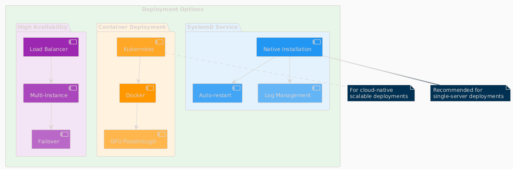

The service supports multiple deployment patterns:

* **SystemD Service**: Native installation with automatic lifecycle management
* **Container Deployment**: Docker-based deployment with GPU passthrough
* **High Availability**: Multi-instance setup with load balancing
* **Cloud-Native**: Kubernetes deployment for scalable cloud environments

=== SystemD Service Deployment

=== Installation Steps

1. **Clone the repository**:
[source,bash]
----
git clone https://github.com/your-org/llm-inference-service.git
cd llm-inference-service
----

2. **Install dependencies**:
[source,bash]
----
# System dependencies
sudo apt-get update
sudo apt-get install -y python3-pip python3-venv nvidia-driver-535

# Python environment
python3 -m venv venv
source venv/bin/activate
pip install -r requirements.txt
----

3. **Build llama.cpp**:
[source,bash]
----
cd /opt/llm/models/ollama-custom-models
git clone https://github.com/ggerganov/llama.cpp
cd llama.cpp
mkdir build && cd build
cmake .. -DLLAMA_CUDA=ON
make -j$(nproc)
----

4. **Configure the service**:
[source,bash]
----
# Copy and edit configuration
cp config/service_config.example.yaml config/service_config.yaml
vim config/service_config.yaml
----

5. **Install SystemD service**:
[source,bash]
----
# For system-wide installation
sudo ./install-service.sh

# For user-level installation
./install-user-service.sh
----

6. **Start the service**:
[source,bash]
----
# System service
sudo systemctl start llm-inference
sudo systemctl enable llm-inference

# User service
systemctl --user start llm-inference
systemctl --user enable llm-inference
----

=== Service Configuration

[source,yaml]
----
# /opt/llm/inference-service/config/service_config.yaml
models_dir: /opt/llm/models/ollama/models/blobs
manifests_dir: /opt/llm/models/ollama/models/manifests
llama_cpp_path: /opt/llm/models/ollama-custom-models/llama.cpp
default_context_size: 131072
tensor_split: '0.25,0.25,0.25,0.25'  # For 4 GPUs
gpu_layers: 999
threads: 32
batch_size: 512
request_timeout: 1800
log_level: INFO
enable_model_inspection: true
preserve_think_tags: true
----

=== Service Management

[source,bash]
----
# Check status
systemctl --user status llm-inference

# View logs
journalctl --user -u llm-inference -f

# Restart service
systemctl --user restart llm-inference

# Stop service
systemctl --user stop llm-inference
----

=== Docker Deployment

=== Building the Image

[source,dockerfile]
----
# Dockerfile
FROM nvidia/cuda:12.2.0-runtime-ubuntu22.04

# Install dependencies
RUN apt-get update && apt-get install -y \
    python3.10 \
    python3-pip \
    git \
    cmake \
    build-essential \
    && rm -rf /var/lib/apt/lists/*

# Set working directory
WORKDIR /app

# Copy application
COPY . .

# Install Python dependencies
RUN pip3 install --no-cache-dir -r requirements.txt

# Build llama.cpp
RUN cd /opt && \
    git clone https://github.com/ggerganov/llama.cpp && \
    cd llama.cpp && \
    mkdir build && cd build && \
    cmake .. -DLLAMA_CUDA=ON && \
    make -j$(nproc)

# Expose port
EXPOSE 11435

# Run the service
CMD ["python3", "-m", "ollama_server.main", "--port", "11435"]
----

=== Docker Compose

[source,yaml]
----
version: '3.8'

services:
  llm-inference:
    build: .
    image: llm-inference:latest
    container_name: llm-inference
    ports:
      - "11435:11435"
    volumes:
      - /opt/llm/models:/opt/llm/models
      - ./config:/app/config
      - ./logs:/app/logs
    environment:
      - NVIDIA_VISIBLE_DEVICES=all
      - CUDA_VISIBLE_DEVICES=0,1,2,3
    deploy:
      resources:
        reservations:
          devices:
            - driver: nvidia
              count: all
              capabilities: [gpu]
    restart: unless-stopped
----

=== Running with Docker

[source,bash]
----
# Build the image
docker-compose build

# Start the service
docker-compose up -d

# View logs
docker-compose logs -f

# Stop the service
docker-compose down
----

=== High Availability Setup

.High Availability Architecture
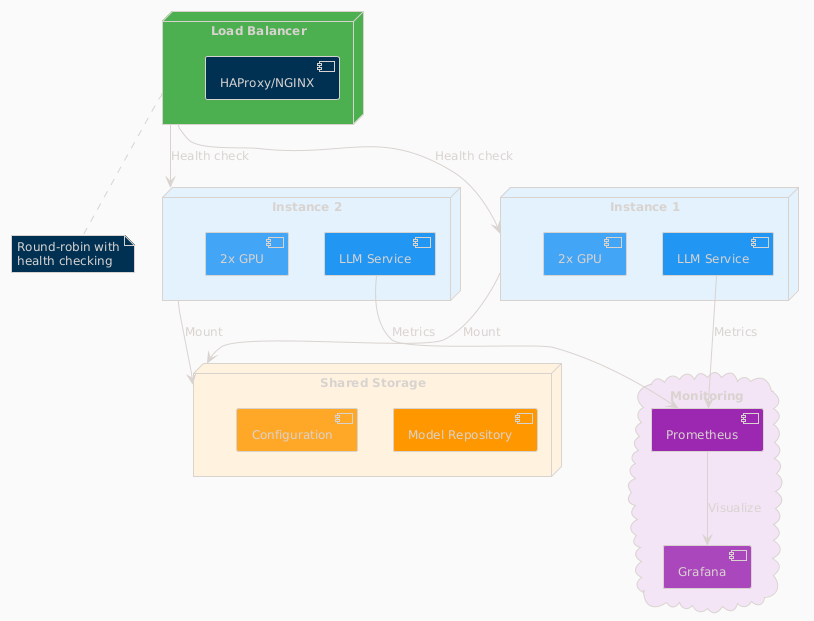


=== Security Considerations

=== Network Security

**SSL/TLS Configuration**:
[source,nginx]
----
server {
    listen 443 ssl http2;
    server_name llm.example.com;
    
    ssl_certificate /etc/ssl/certs/llm.crt;
    ssl_certificate_key /etc/ssl/private/llm.key;
    
    location / {
        proxy_pass http://localhost:11435;
        proxy_set_header Host $host;
        proxy_set_header X-Real-IP $remote_addr;
    }
}
----

=== Authentication

Implement authentication middleware:

[source,python]
----
from functools import wraps
from flask import request, jsonify

def require_api_key(f):
    @wraps(f)
    def decorated_function(*args, **kwargs):
        api_key = request.headers.get('X-API-Key')
        if not api_key or not validate_api_key(api_key):
            return jsonify({'error': 'Invalid API key'}), 401
        return f(*args, **kwargs)
    return decorated_function
----

=== Monitoring Setup

[NOTE]
====
The service includes comprehensive built-in monitoring dashboards:

* Real-time GPU monitoring with thermal management
* API endpoint health tracking
* Model performance analytics
* Hardware optimization insights
* Production monitoring with alerting
====


[NOTE]
====
The service includes built-in web dashboards with all monitoring capabilities.
External monitoring integration (Prometheus/Grafana) is optional for advanced use cases.
====

=== Backup and Recovery

=== Backup Strategy

[source,bash]
----
#!/bin/bash
# backup.sh

BACKUP_DIR="/backup/llm-inference"
DATE=$(date +%Y%m%d_%H%M%S)

# Backup configuration
cp -r /opt/llm/inference-service/config $BACKUP_DIR/config_$DATE

# Backup logs
tar -czf $BACKUP_DIR/logs_$DATE.tar.gz /opt/llm/inference-service/logs

# Backup model metadata (not the models themselves)
cp -r /opt/llm/models/ollama/models/manifests $BACKUP_DIR/manifests_$DATE

echo "Backup completed: $BACKUP_DIR/*_$DATE"
----

=== Recovery Procedure

1. Restore configuration files
2. Restart the service
3. Verify model availability
4. Test API endpoints

=== Troubleshooting

=== Common Issues

[CAUTION]
====
Most issues can be resolved by checking logs and verifying configuration. Always check logs first!
====

[cols="2,3,3", options="header"]
|===
|Issue |Cause |Solution

|Service won't start
|Missing dependencies
|Check logs with `journalctl --user -u llm-inference -n 100`

|GPU not detected
|Driver issues
|Verify with `nvidia-smi` and reinstall drivers if needed

|High memory usage
|Large context windows
|Adjust `default_context_size` in configuration

|Slow inference
|CPU-only mode
|Check `gpu_layers` setting and GPU availability

|Model not found
|Incorrect path
|Verify `models_dir` in configuration
|===

=== Debug Mode

Enable debug logging:

[source,bash]
----
# Edit service config
log_level: DEBUG

# Or run manually
python -m ollama_server.main --debug --port 11435
----

=== Performance Tuning

=== GPU Optimization

[source,yaml]
----
# Optimal settings for 4x Tesla M10
tensor_split: '0.25,0.25,0.25,0.25'
gpu_layers: 999
batch_size: 512
----

=== Context Management

[source,yaml]
----
# Balance between capability and memory
default_context_size: 32768  # For limited VRAM
# default_context_size: 131072  # For ample VRAM
----

=== Request Handling

[source,yaml]
----
# Concurrent request tuning
request_timeout: 1800
max_concurrent_requests: 10  # Adjust based on GPU memory
----

=== Production Checklist

=== Pre-Deployment
- [ ] Hardware requirements verified
- [ ] Dependencies installed and tested
- [ ] Configuration file reviewed and customized
- [ ] SSL certificates configured (if applicable)
- [ ] Network security configured
- [ ] Backup strategy defined

=== Post-Deployment
- [ ] Service health check passing
- [ ] GPU monitoring active
- [ ] API endpoints responsive
- [ ] Dashboard accessible
- [ ] Logging configuration verified
- [ ] Monitoring alerts configured
- [ ] Performance benchmarks established

=== Ongoing Maintenance
- [ ] Regular log rotation
- [ ] Performance monitoring
- [ ] Security updates
- [ ] Configuration backups
- [ ] Capacity planning reviews
== Monitoring

=== Overview

The LLM Inference Service provides comprehensive monitoring capabilities for production deployments.

=== Monitoring Architecture

.Monitoring System Architecture
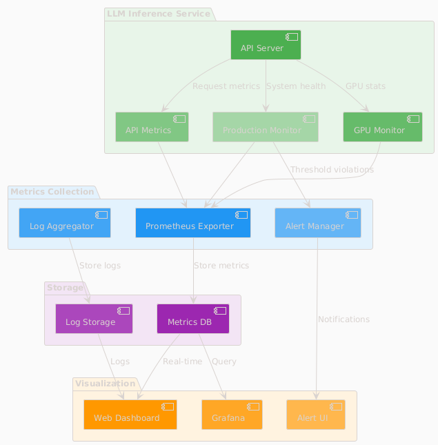

The monitoring system consists of:

* **LLM Inference Service**: Core service with integrated metrics collection
* **Metrics Collection**: Prometheus exporters and log aggregation
* **Visualization**: Web dashboards and Grafana integration
* **Storage**: Time-series database for metrics and log storage
* **Alerting**: Automated alert management and notifications

=== Web Dashboard

=== Dashboard Overview

The service includes a comprehensive web dashboard accessible at `http://localhost:11435/dashboard`.

.Dashboard Pages Architecture
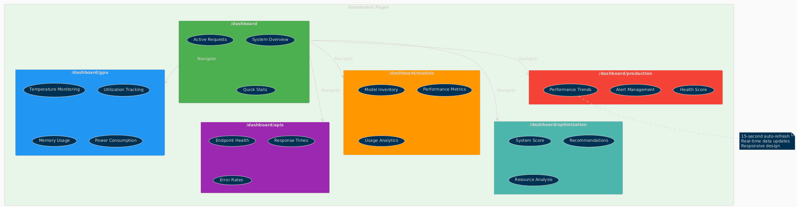

**Dashboard Features:**
* **15-second auto-refresh** to prevent API overload
* **Real-time data updates** with live GPU monitoring
* **Responsive design** for desktop and mobile access
* **Export capabilities** for data analysis and reporting

=== Key Metrics Tracked

[cols="2,3,2", options="header"]
|===
|Metric |Description |Update Frequency

|GPU Temperature
|Per-GPU temperature in Celsius
|Real-time (1s)

|GPU Utilization
|Percentage of GPU compute usage
|Real-time (1s)

|Memory Usage
|VRAM usage per GPU in MB
|Real-time (1s)

|Request Latency
|End-to-end request processing time
|Per request

|Token Generation Rate
|Tokens per second during inference
|Per request

|API Success Rate
|Percentage of successful requests
|1 minute window

|System Health Score
|0-100 composite health indicator
|1 minute

|Active Alerts
|Current unresolved system alerts
|Real-time
|===

=== Production Monitoring

=== Health Score Calculation

.Health Score Calculation Flow
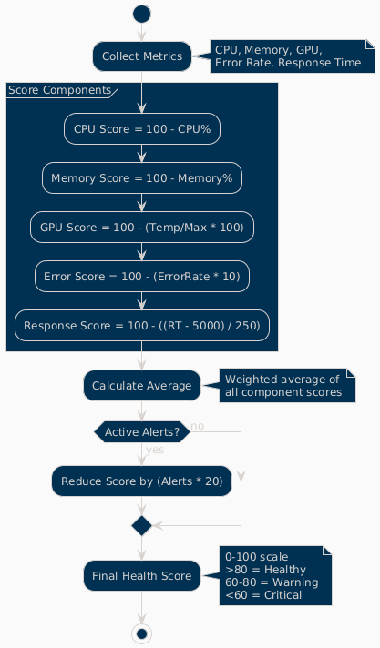

**Scoring Components:**
* **CPU Score**: 100 - CPU utilization percentage
* **Memory Score**: 100 - Memory utilization percentage  
* **GPU Score**: 100 - (Temperature/Max × 100)
* **Error Score**: 100 - (Error rate × 10)
* **Response Score**: 100 - ((Response time - 5000) / 250)

**Final Calculation:**
* Weighted average of all component scores
* Penalty reduction for active alerts (20 points per alert)
* Scale: 0-100 (>80 = Healthy, 60-80 = Warning, <60 = Critical)

=== Alert Configuration

Configure alerts in the Production Monitor dashboard:

[source,yaml]
----
# Alert thresholds
alerts:
  cpu_usage:
    warning: 80    # percentage
    critical: 95
    duration: 300  # seconds
    
  memory_usage:
    warning: 85
    critical: 95
    duration: 300
    
  gpu_temperature:
    warning: 80    # Celsius
    critical: 85
    duration: 180
    
  error_rate:
    warning: 5     # percentage
    critical: 15
    duration: 120
    
  response_time:
    warning: 10000 # milliseconds
    critical: 30000
    duration: 180
----

=== Alert Types

.Alert Processing Flow
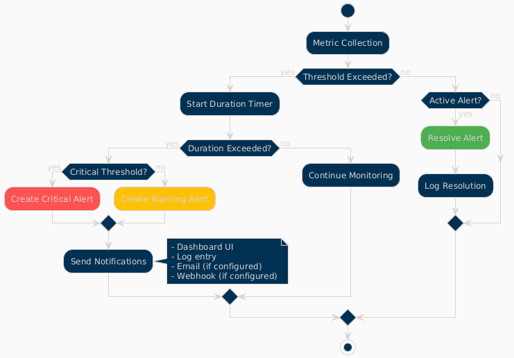

**Alert Lifecycle:**
1. **Metric Collection**: Continuous monitoring of system metrics
2. **Threshold Evaluation**: Check against warning and critical thresholds
3. **Duration Timer**: Prevent false positives with sustained threshold violations
4. **Alert Creation**: Generate warning or critical alerts based on severity
5. **Notification**: Send alerts via dashboard, logs, email, or webhooks
6. **Resolution**: Automatic resolution when metrics return to normal

## GPU Monitoring

=== Metrics Collected

[source,json]
----
{
  "timestamp": "2025-06-07T20:30:00Z",
  "gpus": [
    {
      "index": 0,
      "name": "Tesla M10",
      "temperature": 45,
      "utilization_percent": 35.5,
      "memory_used": 2280,
      "memory_total": 8192,
      "memory_percent": 27.8,
      "power_draw": 30,
      "power_limit": 225,
      "fan_speed": 40
    }
  ],
  "total_memory_used": 9120,
  "total_memory_available": 32768,
  "average_temperature": 48.5,
  "average_utilization": 38.8,
  "thermal_status": "good"
}
----

=== Thermal Management

[cols="2,2,3", options="header"]
|===
|Temperature Range |Status |Action

|< 70°C
|Good
|Normal operation

|70-80°C
|Warning
|Monitor closely, check cooling

|80-85°C
|Critical
|Reduce workload, check fans

|> 85°C
|Emergency
|Throttle or shutdown
|===

=== API Monitoring

=== Endpoint Metrics

Track performance for each API endpoint:

[source,json]
----
{
  "endpoints": [
    {
      "endpoint": "OpenAI API",
      "path": "/api/chat/completions",
      "total_requests": 1527,
      "successful_requests": 1520,
      "failed_requests": 7,
      "average_response_time": 245.3,
      "success_rate": 99.5,
      "last_request_time": "2025-06-07T20:29:45Z",
      "status": "healthy"
    }
  ],
  "timestamp": "2025-06-07T20:30:00Z",
  "overallHealth": "healthy"
}
----

=== Performance Tracking

.Performance Tracking Flow
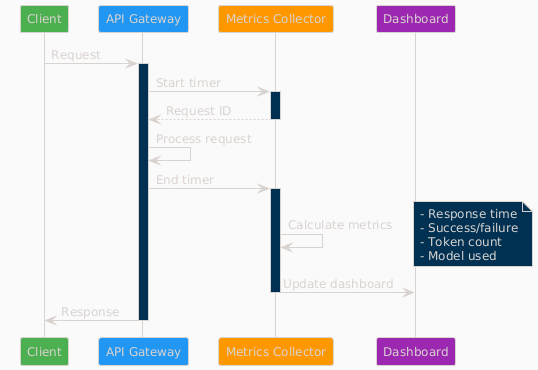

**Tracking Process:**
1. **Request Initiation**: Client sends request to API gateway
2. **Timer Start**: Metrics collector starts response time measurement
3. **Request Processing**: API processes request through inference pipeline
4. **Metrics Calculation**: Calculate response time, success/failure, token count
5. **Dashboard Update**: Real-time dashboard updates with latest metrics

=== Log Management

=== Log Structure

[source,json]
----
{
  "timestamp": "2025-06-07T20:30:00.123Z",
  "level": "INFO",
  "logger": "ollama_server.api.handlers",
  "request_id": "7b4fa8e5-e2a9-4410-b43c-d071c8323fe1",
  "message": "Handling non-streaming request",
  "extra": {
    "api": "openai",
    "model": "phi4:latest",
    "endpoint": "/api/chat/completions",
    "remote_addr": "192.168.1.100"
  }
}
----

=== Log Levels

[cols="1,3,2", options="header"]
|===
|Level |Usage |Example

|ERROR
|System errors, failures
|Model loading failed

|WARNING
|Performance issues, alerts
|High GPU temperature

|INFO
|Normal operations
|Request completed

|DEBUG
|Detailed troubleshooting
|Token generation details
|===

=== Log Rotation

Configure log rotation in `/etc/logrotate.d/llm-inference`:

[source,conf]
----
/opt/llm/inference-service/logs/*.log {
    daily
    rotate 14
    compress
    delaycompress
    missingok
    notifempty
    create 0640 llm llm
    sharedscripts
    postrotate
        systemctl reload llm-inference
    endscript
}
----

=== Performance Optimization

=== Monitoring-Based Optimization

.Optimization Decision Flow
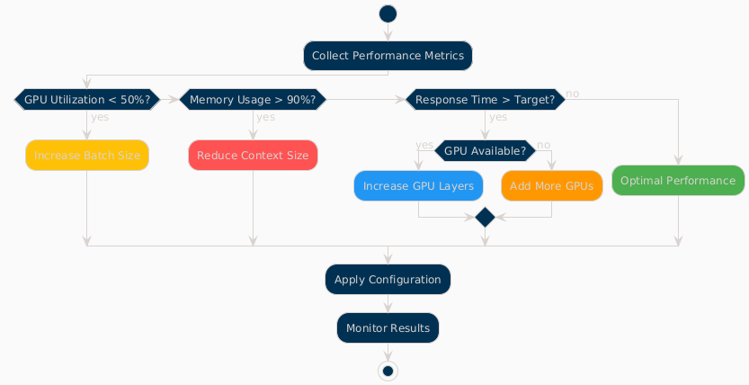

**Optimization Logic:**
* **Low GPU Utilization (<50%)**: Increase batch size for better throughput
* **High Memory Usage (>90%)**: Reduce context size to prevent OOM errors
* **High Response Time**: Increase GPU layers or add more GPUs
* **Optimal Performance**: Maintain current configuration

=== Key Performance Indicators

1. **Throughput**: Tokens per second
2. **Latency**: 95th percentile response time
3. **Efficiency**: GPU utilization percentage
4. **Reliability**: Success rate percentage
5. **Scalability**: Concurrent request capacity

=== Alerting Integration

=== Webhook Configuration

[source,python]
----
# config/alerting.yaml
alerting:
  webhooks:
    - url: "https://hooks.slack.com/services/YOUR/WEBHOOK/URL"
      events: ["critical", "warning"]
      
    - url: "https://api.pagerduty.com/incidents"
      events: ["critical"]
      headers:
        Authorization: "Token token=YOUR_TOKEN"
----

=== Email Alerts

[source,yaml]
----
email:
  smtp_server: "smtp.gmail.com"
  smtp_port: 587
  use_tls: true
  username: "alerts@example.com"
  recipients:
    - "ops-team@example.com"
    - "on-call@example.com"
----

=== Grafana Integration

=== Prometheus Metrics Export

The service exposes Prometheus-compatible metrics at `/metrics`:

[source,prometheus]
----
# HELP llm_request_duration_seconds Request duration
# TYPE llm_request_duration_seconds histogram
llm_request_duration_seconds_bucket{api="openai",model="phi4",le="0.1"} 245
llm_request_duration_seconds_bucket{api="openai",model="phi4",le="0.5"} 1203

# HELP llm_gpu_temperature_celsius GPU temperature
# TYPE llm_gpu_temperature_celsius gauge
llm_gpu_temperature_celsius{gpu="0",name="Tesla M10"} 45

# HELP llm_active_requests Number of active requests
# TYPE llm_active_requests gauge
llm_active_requests 3
----

=== Sample Grafana Dashboard

Import `monitoring/grafana-dashboard.json` for pre-configured panels:

* Request rate and latency
* GPU utilization heatmap
* Model performance comparison
* System resource usage
* Alert history

=== Troubleshooting with Monitoring

=== Performance Issues

1. Check GPU utilization in dashboard
2. Review response time trends
3. Analyze error logs
4. Verify resource allocation

=== Common Patterns

[cols="2,3,3", options="header"]
|===
|Pattern |Likely Cause |Investigation

|Increasing latency
|Memory pressure, thermal throttling
|Check GPU temperature and VRAM usage

|Error rate spikes
|Model issues, OOM errors
|Review error logs and GPU memory

|Low GPU utilization
|CPU bottleneck, small batch size
|Increase batch size, check CPU usage

|Intermittent failures
|Resource contention, driver issues
|Check system logs and dmesg
|===

=== Monitoring Best Practices

=== Dashboard Usage
* Monitor main dashboard for system overview
* Use specialized dashboards for detailed analysis
* Set up automated alerts for critical metrics
* Export data for trend analysis and capacity planning

=== Alert Configuration
* Set appropriate warning and critical thresholds
* Use duration-based triggering to prevent false positives
* Configure multiple notification channels for redundancy
* Regular review and tuning of alert thresholds

=== Performance Monitoring
* Establish baseline performance metrics
* Monitor trends for capacity planning
* Use optimization insights for system tuning
* Regular performance reviews and adjustments

=== Log Analysis
* Configure appropriate log levels for environment
* Implement log rotation to manage disk space
* Use structured logging for better analysis
* Regular log review for security and performance insights

== Quick Start

=== Installation

[IMPORTANT]
====
The service runs on port 11435 by default. Ensure this port is available before installation.
====

[source,bash]
----
# Install user-level SystemD service
./install-user-service.sh

# Start the service (runs on port 11435)
systemctl --user start llm-inference

# Access web dashboard
open http://localhost:11435/dashboard
----

=== Test API

[TIP]
====
Use `tinyllama:1.1b-chat` for quick testing - it's a small, fast model ideal for verifying your installation.
====

[source,bash]
----
# List models
curl http://localhost:11435/api/models

# Test with fast model
curl -X POST http://localhost:11435/api/chat/completions \
  -H "Content-Type: application/json" \
  -d '{"model": "tinyllama:1.1b-chat", "messages": [{"role": "user", "content": "Hi"}]}'
----

=== Production Status (v1.0)

[cols="2,2,2"]
|===
|Component |Status |Details

|**Multi-API Support**
|✅ v1.0 Production Ready
|OpenAI, Ollama, vLLM, HuggingFace TGI with auto model selection

|**GPU Monitoring**
|✅ v1.0 Production Ready
|4x Tesla M10 with thermal management and power tracking

|**Dashboard System**
|✅ v1.0 Production Ready
|6 specialized dashboards, 15s refresh, real-time metrics

|**Model Management**
|✅ v1.0 Production Ready
|52+ models, up to 131K context detection, think tag support

|**Hardware Optimization**
|✅ v1.0 Production Ready
|100.0/100 system score, intelligent recommendations, dynamic config

|**API Health Monitoring**
|✅ v1.0 Production Ready
|Real-time endpoint tracking, response time analysis, error handling
|===

=== Dashboard Pages Overview

[cols="1,3,2"]
|===
|Dashboard Page |Description |Access Path

|**Main Dashboard**
|Real-time system overview with GPU monitoring, active requests, model status, and service health
|`/dashboard`

|**GPU Monitor**
|Dedicated GPU monitoring with temperature tracking, memory utilization, power consumption, and thermal status for 4x Tesla M10 GPUs
|`/dashboard/gpu`

|**Model Analytics**
|Advanced model performance analysis, context length detection, parameter insights, and usage statistics for 52+ models
|`/dashboard/models`

|**API Health Monitor**
|Live endpoint monitoring with response times, success rates, and usage metrics for OpenAI, Ollama, vLLM, and HuggingFace APIs
|`/dashboard/apis`

|**Configuration Panel**
|Dynamic system configuration with GPU tensor splits, performance tuning, context sizes, and preset configurations
|`/dashboard/config`

|**Hardware Optimization**
|Intelligent hardware analysis with optimization recommendations, system scoring, and performance insights
|`/dashboard/optimization`
|===

=== Dashboard Features

.LLM Inference Service - Main Dashboard


.GPU Monitor Dashboard


.Configuration Panel
image::images/llm-service-main-configset.png[Configuration Panel,1200,800]

.Hardware Optimization Dashboard


**Key Features:**
* Real-time GPU monitoring (4x Tesla M10)
* 15-second dashboard refresh intervals
* Dynamic configuration management
* Hardware optimization scoring (100.0/100 current score)
* API metrics tracking with actual endpoint data
* 52+ model management with context detection up to 131K tokens


== License

Licensed under the Apache License, Version 2.0 (the "License");
you may not use this file except in compliance with the License.
You may obtain a copy of the License at

    http://www.apache.org/licenses/LICENSE-2.0

Unless required by applicable law or agreed to in writing, software
distributed under the License is distributed on an "AS IS" BASIS,
WITHOUT WARRANTIES OR CONDITIONS OF ANY KIND, either express or implied.
See the License for the specific language governing permissions and
limitations under the License.

=== Third-Party Licenses

This project builds upon and includes code from:

* **llama.cpp**: MIT License - High-performance LLM inference engine
* **Flask**: BSD License - Web framework
* **Ollama**: MIT License - Model format and API design inspiration

See the `NOTICE` file for complete license information and attributions.

== Support

For support and questions:

* **Issues**: Create an issue in the project repository
* **Documentation**: Check this README and inline code documentation
* **Community**: Join the discussion in project forums

== Acknowledgments

This project builds upon the excellent work of:

* **llama.cpp**: High-performance LLM inference engine
* **Ollama**: Model format and API design inspiration  
* **OpenAI**: API compatibility standards
* **Flask**: Web framework foundation