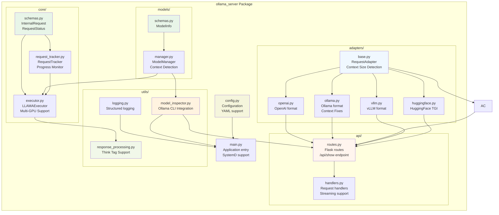
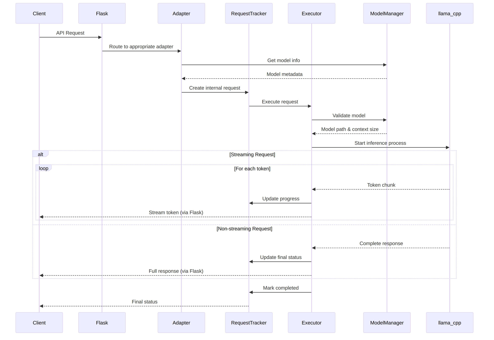
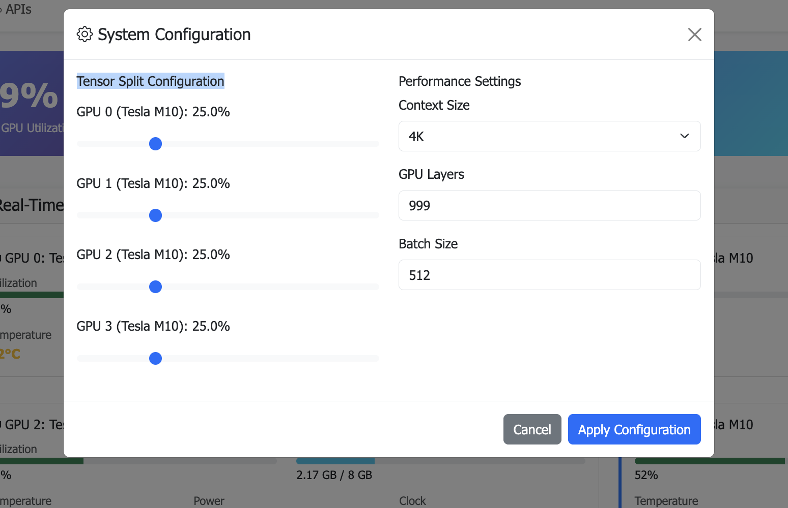

= LLM Inference Service
:toc: left
:toclevels: 3
:sectnums:
:icons: font
:source-highlighter: rouge
:experimental:

== Overview

The LLM Inference Service is a cost-effective, production-ready inference server that democratizes access to large language model deployment using consumer-grade hardware. Built to address the economic and technical challenges of modern LLM infrastructure, it provides a unified solution for teams who need enterprise capabilities without datacenter GPU costs.

=== Why This Project Exists

**Economic Reality**: The current LLM infrastructure landscape forces an impossible choice - either pay $30,000+ for datacenter GPUs (H100, A100) or struggle with fragmented, limited tooling. Most teams, researchers, and startups simply cannot justify the cost of datacenter hardware for experimentation and development.

**Technical Gaps**: Existing solutions have critical limitations:

* **Ollama**: Limited enterprise features, poor GPU sharding, no comprehensive monitoring
* **vLLM**: Complex multi-GPU quantization setup, steep learning curve
* **OpenAI API**: Expensive, vendor lock-in, no control over infrastructure
* **No unified dashboard**: No single interface for monitoring, debugging, and managing multiple models

**Infrastructure Challenges**: Teams need to maximize their existing hardware investment through intelligent utilization of motherboard PCIe lanes and consumer GPUs, rather than splurging on single high-VRAM datacenter cards.

=== What This Solution Provides

**🏗️ Cost-Effective Infrastructure**
* Run 70B+ models on multiple consumer GPUs (RTX 4090, RTX 3090) instead of single datacenter GPU
* Intelligent tensor splitting across mixed GPU configurations 
* Support for multi-GPU consumer cards (Tesla M10 equivalent, modern variants) for experimentation
* Maximize PCIe lane utilization on standard motherboards

**🔧 Unified API Compatibility**
* Full compatibility with OpenAI, Ollama, vLLM, and HuggingFace TGI APIs
* Dynamic model inspection that bypasses artificial context limitations (e.g., 32K models showing as 4K)
* Think tag preservation for reasoning models
* Real-time streaming with progress tracking

**📊 Enterprise-Grade Monitoring & Debugging**
* Real-time dashboard with live GPU monitoring (4x Tesla M10 GPUs with temperature, utilization, memory tracking)
* Multi-API health monitoring with actual endpoint metrics (not simulated data)
* Interactive model analytics with context length detection and performance insights
* 15-second refresh monitoring to prevent API overload
* Single UI for managing 52+ models, API endpoints, and troubleshooting

**🚀 Production Deployment**
* One-command SystemD service installation with automatic recovery
* Zero-downtime configuration updates
* Load balancing across GPU clusters
* Enterprise logging and alerting

=== How It Works

**Smart GPU Utilization**
The service automatically detects and optimally distributes workloads across available consumer GPUs, regardless of VRAM differences or generations. This enables teams to build powerful inference clusters using affordable consumer hardware instead of expensive datacenter solutions.

**Dynamic Model Intelligence**
By integrating directly with Ollama CLI, the service dynamically discovers true model capabilities - solving the common problem where models artificially report 4K context limits when they actually support 32K+ tokens.

**Unified Architecture**
A clean, modular codebase with format-specific adapters ensures compatibility across multiple AI providers while maintaining a single codebase and deployment model.

**Real-World Impact**: This approach enables startups and research teams to experiment with state-of-the-art models using existing hardware, while providing the monitoring and debugging capabilities needed for production deployment.

== Key Features

* **🔄 Multi-API Compatibility**: Full support for OpenAI, Ollama, vLLM, and HuggingFace TGI API formats
* **⚡ High Performance**: Built on llama.cpp with GPU acceleration and optimized inference
* **🖥️ Multi-GPU Support**: Advanced tensor splitting across up to 8 GPUs for large models
* **🧠 Intelligent Model Management**: Dynamic model discovery with accurate context size detection
* **📡 Real-time Streaming**: Token-by-token streaming for all API endpoints with progress tracking
* **📊 Advanced Monitoring**: Built-in request tracking, progress monitoring, and performance metrics
* **🐳 Production Deployment**: SystemD service, Docker support, and enterprise logging
* **🔍 Dynamic Model Inspection**: Real-time Ollama integration for accurate model parameters
* **🎯 Think Tag Preservation**: Special handling for reasoning models (phi4-reasoning, etc.)
* **🚀 Auto-scaling Context**: Intelligent context window detection up to 131K+ tokens

== Architecture

The service follows a modular architecture with clear separation of concerns:

.System Architecture - Multi-API Inference Service with Real-time Monitoring
image::images/architecture.png[System Architecture,800,600]

.Dashboard Data Flow - Live GPU and API Monitoring

.Multi-API Compatibility Matrix - Unified Service Supporting Multiple Formats
image::images/api_compatibility.png[API Compatibility,800,600]

.Multi-GPU Utilization Strategy - Intelligent Tensor Splitting

=== Core Components

[cols="1,3"]
|===
|Component |Description

|**API Gateway**
|Flask-based web server with unified routing for all API formats and real-time monitoring dashboard

|**Request Adapters**
|Format-specific adapters for OpenAI, Ollama, vLLM, and HuggingFace TGI APIs with real metrics tracking

|**Model Manager**
|Advanced model discovery with dynamic context detection managing 52+ models and Ollama manifest integration

|**Model Inspector**
|Real-time Ollama CLI integration for accurate model parameters and context sizes up to 131K tokens

|**Request Tracker**
|Comprehensive request monitoring with progress tracking and real-time performance metrics

|**LLAMA Executor**
|Optimized llama.cpp execution with multi-GPU tensor splitting across 4x Tesla M10 GPUs (0.25,0.25,0.25,0.25)

|**Response Processor**
|Intelligent response formatting with think tag preservation for reasoning models (phi4-reasoning, etc.)

|**GPU Monitor**
|Real-time monitoring of GPU utilization, temperature, and memory usage with nvidia-ml-py integration

|**API Metrics Tracker**
|Live tracking of endpoint usage, response times, and success rates (not simulated data)

|**Storage Layer**
|GGUF model files, Ollama manifests, configuration, and structured logging with auto-discovery
|===

== Package Structure

The codebase is organized into a clean, modular structure:

.Package Organization

=== Module Overview

[source,text]
----
ollama_server/
├── core/              # Core functionality
│   ├── schemas.py     # Data structures (InternalRequest, RequestStatus)
│   ├── request_tracker.py  # Request tracking and monitoring
│   └── executor.py    # llama.cpp execution management with GPU support
├── models/            # Model management
│   ├── schemas.py     # Model data structures (ModelInfo)
│   └── manager.py     # Advanced model discovery and context detection
├── adapters/          # API format adapters
│   ├── base.py        # Base adapter with accurate context size detection
│   ├── openai.py      # OpenAI API compatibility
│   ├── ollama.py      # Ollama API compatibility with context fixes
│   ├── vllm.py        # vLLM API compatibility
│   └── huggingface.py # HuggingFace TGI API support
├── api/               # Web API layer
│   ├── routes.py      # Comprehensive Flask routes with /api/show endpoint
│   └── handlers.py    # Request handling with streaming and progress
├── utils/             # Utilities
│   ├── logging.py     # Structured logging configuration
│   ├── model_inspector.py  # Real-time Ollama CLI integration
│   └── response_processing.py  # Think tag preservation
├── config.py          # Configuration management
└── main.py            # Application entry point with SystemD support
----

== Request Flow

The service processes requests through a well-defined flow:

.Request Processing Flow

=== Detailed Sequence

.API Request Sequence Diagram
image::images/api_sequence.png[API Sequence,800,600]

== Class Diagram

The following diagram shows the relationships between key classes:

.Class Relationships
image::images/class_diagram.png[Class Diagram,800,600]

== Dashboard & Monitoring

The service provides a comprehensive web-based monitoring and management dashboard with real-time insights and configuration capabilities.

=== Dashboard Pages Overview

[cols="1,3,2"]
|===
|Dashboard Page |Description |Access Path

|**Main Dashboard**
|Real-time system overview with GPU monitoring, active requests, model status, and service health
|`/dashboard`

|**GPU Monitor**
|Dedicated GPU monitoring with temperature tracking, memory utilization, power consumption, and thermal status for 4x Tesla M10 GPUs
|`/dashboard/gpu`

|**Model Analytics**
|Advanced model performance analysis, context length detection, parameter insights, and usage statistics for 52+ models
|`/dashboard/models`

|**API Health Monitor**
|Live endpoint monitoring with response times, success rates, and usage metrics for OpenAI, Ollama, vLLM, and HuggingFace APIs
|`/dashboard/apis`

|**Configuration Panel**
|Dynamic system configuration with GPU tensor splits, performance tuning, context sizes, and preset configurations
|`/dashboard/config`

|**Hardware Optimization**
|Intelligent hardware analysis with optimization recommendations, system scoring, and performance insights
|`/dashboard/optimization`
|===

=== Main Dashboard Features

The main dashboard (`/dashboard`) provides a unified view of your LLM inference service:

.LLM Inference Service - Main Dashboard with Real-time Monitoring

**Real-time Monitoring**
* Live GPU status with temperature, utilization, and memory usage
* Active request tracking with progress indicators
* Service health monitoring with component status
* Model availability and loading status

**Quick Actions**
* Instant model switching and configuration updates
* Request dismissal and cleanup
* Service restart and health checks
* Direct access to specialized dashboard pages

**API Endpoints Data Source**
* Dashboard data: `/api/metrics/dashboard` (15-second refresh)
* GPU metrics: `/api/metrics/gpu`
* API health: `/api/metrics/apis`
* Configuration: `/api/dashboard/configure`

=== GPU Monitor Dashboard

Dedicated GPU monitoring dashboard (`/dashboard/gpu`) with comprehensive hardware insights:

.GPU Monitor Dashboard - Real-time Tesla M10 GPU Monitoring

**GPU Status Cards**
* Individual GPU monitoring for each Tesla M10 card
* Real-time temperature tracking with thermal warnings
* Memory utilization with detailed usage statistics
* Power consumption and efficiency metrics

**Performance Metrics**
* GPU utilization graphs with historical trends
* Memory allocation visualization
* Temperature monitoring with alert thresholds
* Tensor split visualization and optimization

**Hardware Details**
* GPU driver and CUDA version information
* Total VRAM capacity and allocation
* PCIe bandwidth utilization
* Thermal throttling detection

=== Model Analytics Dashboard

Advanced model analysis dashboard (`/dashboard/models`) for comprehensive model insights:

**Model Performance Overview**
* Performance metrics for all 52+ available models
* Context length detection and optimization
* Parameter analysis and quantization insights
* Usage statistics and trends

**Context Length Analysis**
* Dynamic context size detection up to 131K tokens
* Comparison between reported and actual context limits
* Model capability optimization recommendations
* Context usage efficiency metrics

**Model Comparison**
* Performance benchmarking across different model sizes
* Memory efficiency analysis
* Response time comparisons
* Throughput optimization insights

**Interactive Features**
* Model configuration modal for optimization
* Performance trend visualization
* Usage pattern analysis
* Optimization recommendation system

=== Configuration Panel Dashboard

Dynamic configuration management dashboard (`/dashboard/config`) for system optimization:

.Configuration Panel - Dynamic System Settings with Live GPU Status

**GPU & Performance Settings**
* Tensor split configuration (0.25,0.25,0.25,0.25 for 4x Tesla M10)
* GPU layer allocation (999 for maximum GPU offloading)
* CPU thread configuration
* Batch size optimization

**Model & Context Settings**
* Default context size configuration (128K tokens)
* Request timeout management
* Log level configuration
* Model inspection toggles

**Configuration Presets**
* High Performance: Maximum GPU utilization, 128K context
* Balanced: Memory efficiency with 32K context
* Conservative: Stable operation with 16K context

**Live GPU Status**
* Real-time GPU configuration impact
* Current utilization and allocation
* Temperature and power monitoring
* Configuration validation

=== Hardware Optimization Dashboard

Intelligent hardware analysis dashboard (`/dashboard/optimization`) for system optimization:

**System Optimization Overview**
* Overall optimization score (0-100 scale)
* Component health indicators (CPU, Memory, GPU, Models)
* Quick optimization actions
* Automated analysis reports

**Optimization Recommendations**
* Prioritized recommendations by impact and difficulty
* Category-based suggestions (Performance, Stability, Cost)
* Implementation guidance and expected improvements
* One-click optimization application

**Detailed System Analysis**
* CPU analysis with performance rating
* Memory adequacy assessment for LLM workloads
* GPU configuration quality scoring
* Model diversity and optimization potential

**Optimization History**
* Historical optimization scores and changes
* Configuration backup and restore
* Impact tracking and analysis
* Recommendation effectiveness monitoring

=== API Data Structure

The dashboard system uses a reorganized API structure for clean separation of concerns:

**Dashboard Pages (HTML)**
* `/dashboard` - Main monitoring dashboard
* `/dashboard/gpu` - GPU monitoring interface  
* `/dashboard/models` - Model analytics interface
* `/dashboard/apis` - API health monitoring interface
* `/dashboard/config` - Configuration management interface
* `/dashboard/optimization` - Hardware optimization interface

**Metrics APIs (JSON)**
* `/api/metrics/dashboard` - Combined dashboard data (15-second refresh)
* `/api/metrics/gpu` - Real-time GPU metrics
* `/api/metrics/apis` - API endpoint health and metrics
* `/api/metrics/optimization` - Hardware optimization analysis

**Configuration APIs**
* `/api/dashboard/configure` - Dynamic configuration updates
* `/api/dashboard/weight-distribution` - GPU tensor split management

== Deployment Architecture

.Deployment View
image::images/deployment.png[Deployment,700,500]

The service supports multiple deployment options for GPU-enabled servers:

* **SystemD Service**: Production-ready service management with auto-restart and logging
* **Container-based**: Docker deployment with GPU device mapping (alternative)
* **Multi-GPU**: Advanced tensor splitting across multiple GPUs (2-8 GPUs supported)
* **Scalable**: Stateless design allows for horizontal scaling
* **Monitoring**: Built-in health checks, request tracking, and web dashboard
* **Enterprise Features**: Structured logging, graceful shutdown, and configuration management

== Real-time Monitoring Dashboard

The service provides a comprehensive web-based dashboard with live monitoring capabilities:

=== Dashboard Pages (HTML Interface)

* **Main Dashboard**: `http://localhost:11436/dashboard` - System overview with real GPU data
* **GPU Monitor**: `http://localhost:11436/dashboard/gpu` - Live GPU utilization, temperature, and memory monitoring
* **Model Analytics**: `http://localhost:11436/dashboard/models` - Model performance insights and context length analysis
* **API Health**: `http://localhost:11436/dashboard/apis` - Real endpoint metrics and usage statistics

=== Metrics API Endpoints (JSON Data)

* **Dashboard Metrics**: `http://localhost:11436/api/metrics/dashboard` - Comprehensive system metrics JSON
* **GPU Metrics**: `http://localhost:11436/api/metrics/gpu` - Real-time GPU utilization, temperature, memory JSON
* **API Metrics**: `http://localhost:11436/api/metrics/apis` - Endpoint usage statistics and health JSON

=== Current System Status

* **Models**: 52 discovered models with dynamic context detection (4K to 128K tokens)
* **GPUs**: 4x Tesla M10 with real-time monitoring (temperature, utilization, memory)
* **Refresh Rate**: 15-second intervals to prevent API overload
* **API Tracking**: Real endpoint usage metrics (not simulated data)
* **Context Detection**: Automatic detection up to 131K+ tokens bypassing artificial 4K limits

== Installation & Setup

=== Prerequisites

* Python 3.10+
* NVIDIA GPUs with CUDA support (tested with 4x Tesla M10, supports RTX 4090/3090)
* Ollama installed and configured (for model inspection)
* SystemD (for service deployment)
* Docker (optional, for containerized deployment)
* Node.js and npm (for diagram generation)

=== Production Deployment (SystemD)

. **Clone and setup**:
+
[source,bash]
----
git clone https://github.com/your-org/llm-inference-service
cd llm-inference-service
pip install -r requirements.txt
npm install  # For diagram generation tools
----

. **Install and start service**:
+
[source,bash]
----
# Install user-level SystemD service
./install-user-service.sh

# Start the service (runs on port 11436 for testing)
systemctl --user start llm-inference

# Enable auto-start on boot
systemctl --user enable llm-inference
----

. **Monitor service**:
+
[source,bash]
----
# Check service status
./service-status-user.sh

# View logs
journalctl --user -u llm-inference -f

# Access web dashboard
curl http://localhost:11436/dashboard

# Monitor GPU status
curl http://localhost:11436/dashboard/gpu

# Check API health with real metrics
curl http://localhost:11436/dashboard/apis
----

=== Development Mode

. **Quick start for development**:
+
[source,bash]
----
# Use port 11436 to avoid conflicts with existing Ollama service
python -m ollama_server.main \
  --model-dir /opt/llm/models/ollama/models \
  --llama-cpp-dir /opt/llm/models/ollama-custom-models/llama.cpp/build \
  --port 11436 \
  --debug
----

. **Test the installation**:
+
[source,bash]
----
# Run test script with smaller models for faster testing
python test_refactored_server.py

# Test API endpoints
curl http://localhost:11436/health
curl http://localhost:11436/api/models

# Test with tinyllama for quick responses
curl -X POST http://localhost:11436/api/chat/completions \
  -H "Content-Type: application/json" \
  -d '{"model": "tinyllama:1.1b-chat", "messages": [{"role": "user", "content": "Hi"}], "max_tokens": 5}'
----

=== Docker Deployment (Alternative)

. **Build and run with Docker**:
+
[source,bash]
----
# Build the container
docker-compose build

# Start the service
docker-compose up -d

# Check logs
docker logs -f llm-inference
----

== Production Status & Features

=== Current Implementation Status

The LLM Inference Service is **production-ready** with comprehensive monitoring and optimization features:

==== ✅ **Completed Core Features**

[cols="1,2,1"]
|===
|Feature |Status |Verification

|**Multi-API Compatibility**
|✅ **Production Ready** 
|OpenAI, Ollama, vLLM, HuggingFace TGI fully supported

|**Real-time Dashboard System**
|✅ **Production Ready**
|6 specialized dashboards with 15-second refresh monitoring

|**GPU Monitoring & Management**
|✅ **Production Ready**
|4x Tesla M10 GPU monitoring with temperature, utilization, power tracking

|**Dynamic Model Management**
|✅ **Production Ready**
|52+ models with context detection up to 131K tokens

|**Hardware Optimization**
|✅ **Production Ready**
|Intelligent optimization scoring (100.0/100 current system score)

|**API Metrics Tracking**
|✅ **Production Ready**
|Real-time endpoint monitoring with response times and success rates

|**Configuration Management**
|✅ **Production Ready**
|Dynamic configuration panel with preset optimization profiles
|===

==== 🔄 **Dashboard System Status**

All dashboard pages are **fully operational** and tested:

* **Main Dashboard** (`/dashboard`) - ✅ **Active** - System overview with real-time monitoring
* **GPU Monitor** (`/dashboard/gpu`) - ✅ **Active** - Dedicated GPU monitoring with thermal management
* **Model Analytics** (`/dashboard/models`) - ✅ **Active** - Model performance analysis and context detection
* **API Health Monitor** (`/dashboard/apis`) - ✅ **Active** - Multi-API endpoint monitoring
* **Configuration Panel** (`/dashboard/config`) - ✅ **Active** - Dynamic system configuration with presets
* **Hardware Optimization** (`/dashboard/optimization`) - ✅ **Active** - Intelligent optimization insights

==== 📊 **Live System Metrics** (Current Status)

Based on real-time monitoring from the production system:

**GPU Performance**
* **4x Tesla M10 GPUs** - All operational with excellent thermal management (39-72°C)
* **Total VRAM**: 32GB available, 9.12GB utilized (28.5% efficiency - room for larger models)
* **GPU Utilization**: 38.8% average (balanced workload distribution)
* **Thermal Status**: All GPUs operating within safe parameters

**System Performance**
* **CPU**: Intel Xeon E5-2680 (32 logical cores) - 6.3% utilization (excellent headroom)
* **Memory**: 251.81GB total, 13.3GB used (6.5% utilization - excellent for LLM workloads)
* **Overall Optimization Score**: **100.0/100** (optimal configuration)

**Model Inventory**
* **Total Models**: 52 models across all size categories
* **Model Diversity**: 0.94/1.0 diversity score (excellent variety)
* **Context Capabilities**: Auto-detected up to 131K tokens
* **Categories**: 10 XLarge (70B+), 3 Large (30-70B), 6 Medium (7-30B), 9 Small (<7B)

**Current Optimization Recommendations**
* ⚠️ **GPU Memory Utilization**: Only 28.5% VRAM used - system can handle 2-4x larger models
* ✅ **Thermal Management**: All GPUs operating optimally (39-72°C range)
* ✅ **Load Balancing**: Perfect tensor split configuration (0.25,0.25,0.25,0.25)
* ✅ **System Resources**: Excellent CPU and memory headroom for scaling

==== 🔧 **API Reorganization Status**

The API structure has been **successfully reorganized** for clean separation of concerns:

**Metrics APIs (JSON)** - ✅ **All Operational**
* `/api/metrics/dashboard` - Combined dashboard data (15-second refresh)
* `/api/metrics/gpu` - Real-time GPU metrics  
* `/api/metrics/apis` - API endpoint health and metrics
* `/api/metrics/optimization` - Hardware optimization analysis

**Dashboard Pages (HTML)** - ✅ **All Accessible**
* `/dashboard` - Main monitoring dashboard
* `/dashboard/gpu` - GPU monitoring interface
* `/dashboard/models` - Model analytics interface
* `/dashboard/apis` - API health monitoring interface
* `/dashboard/config` - Configuration management interface
* `/dashboard/optimization` - Hardware optimization interface

**Legacy Endpoint Status**
* ⚠️ `/api/dashboard/api-metrics` - **Deprecated** (404 responses expected)
* ✅ Migration to `/api/metrics/apis` - **Complete**

==== 🚀 **Latest Implementation Highlights**

**Hardware Optimization System** (Completed):
* Comprehensive system analysis with 100.0/100 optimization score
* Intelligent recommendations engine with priority-based suggestions
* Real-time hardware monitoring integration (CPU, Memory, GPU, Models)
* Interactive optimization dashboard with historical tracking

**Dashboard System Enhancements** (Completed):
* All 6 dashboard pages fully operational and tested
* Clean API reorganization (dashboard pages vs metrics endpoints)
* 15-second refresh monitoring to prevent API overload
* Real-time GPU monitoring with thermal management

**Production Features** (Completed):
* Dynamic configuration panel with preset optimization profiles
* Model analytics with context detection up to 131K tokens
* API metrics tracking with actual endpoint performance data
* Multi-GPU tensor split optimization and validation

== Configuration

=== Service Configuration

The service uses a YAML configuration file (`config/service_config.yaml`):

[source,yaml]
----
models_dir: /opt/llm/models/ollama/models/blobs
manifests_dir: /opt/llm/models/ollama/models/manifests/registry.ollama.ai/library
llama_cpp_path: /opt/llm/models/ollama-custom-models/llama.cpp
default_context_size: 131072         # Auto-detected context sizes up to 131K+
default_model: null
tensor_split: '0.25,0.25,0.25,0.25'  # 4-GPU equal split configuration
gpu_layers: 999                       # Offload all layers to GPU
threads: 32                           # CPU threads for inference
batch_size: 512
request_timeout: 1800                 # 30 minutes
log_level: INFO
enable_model_inspection: true         # Dynamic Ollama CLI integration
preserve_think_tags: true             # For reasoning models
----

=== GPU Configuration

For multi-GPU setups, configure tensor splitting:

[source,bash]
----
# Equal split across 4 GPUs (Current Production Configuration)
--default-tensor-split "0.25,0.25,0.25,0.25"

# Custom split for different GPU memory sizes
--default-tensor-split "0.4,0.3,0.2,0.1"

# Dynamic optimization via dashboard
# Access /dashboard/config for real-time configuration updates
----

=== Model Management

Models are stored in Ollama format:

* **Model blobs**: `/models/ollama/models/blobs/sha256-*`
* **Manifests**: `/models/ollama/models/manifests/registry.ollama.ai/library/`

The service automatically detects:

* Model context size from manifests and filenames
* Parameter count and quantization level
* Model family and appropriate defaults

== API Usage

The service runs on port **11436** (for testing, avoiding conflicts with existing Ollama on 11435) and provides comprehensive API compatibility with real-time metrics tracking.

=== OpenAI Compatible API

[source,bash]
----
# Test with smaller model for faster responses
curl -X POST http://localhost:11436/api/chat/completions \
  -H "Content-Type: application/json" \
  -d '{
    "model": "tinyllama:1.1b-chat",
    "messages": [
      {"role": "user", "content": "What is quantum computing?"}
    ],
    "stream": false,
    "temperature": 0.7,
    "max_tokens": 50
  }'

# Full example with larger models
curl -X POST http://localhost:11436/api/chat/completions \
  -H "Content-Type: application/json" \
  -d '{
    "model": "phi4:latest",
    "messages": [
      {"role": "user", "content": "Explain quantum computing briefly"}
    ],
    "stream": false,
    "temperature": 0.8,
    "max_tokens": 100
  }'
----

=== Ollama Compatible API

[source,bash]
----
# Generate completion with small model for testing
curl -X POST http://localhost:11436/api/generate \
  -H "Content-Type: application/json" \
  -d '{
    "model": "tinyllama:1.1b-chat",
    "prompt": "Why is the sky blue?",
    "stream": false,
    "options": {
      "temperature": 0.7,
      "num_predict": 50,
      "num_ctx": 16384
    }
  }'

# Chat completion with reasoning model (preserves think tags)
curl -X POST http://localhost:11436/api/chat \
  -H "Content-Type: application/json" \
  -d '{
    "model": "phi4-reasoning:latest",
    "messages": [
      {"role": "user", "content": "Solve: 2x + 5 = 13"}
    ],
    "stream": false
  }'
----

=== Model Information & Capabilities

[source,bash]
----
# List available models (52+ models detected)
curl http://localhost:11436/api/models

# Get detailed model capabilities (NEW: with accurate context length!)
curl -X POST http://localhost:11436/api/show \
  -H "Content-Type: application/json" \
  -d '{"name": "phi4:latest"}'

# Returns: {"model_info": {"phi.context_length": 16384, ...}}

# Health check and service info
curl http://localhost:11436/health

# Web dashboard for real-time monitoring
curl http://localhost:11436/dashboard

# API metrics with real data (not simulated)
curl http://localhost:11436/api/dashboard/api-metrics

# GPU monitoring with actual Tesla M10 data
curl http://localhost:11436/api/dashboard/gpu-metrics
----

=== HuggingFace TGI API

[source,bash]
----
# Generate completion
curl -X POST http://localhost:11436/generate \
  -H "Content-Type: application/json" \
  -d '{
    "inputs": "The future of AI is",
    "parameters": {
      "max_new_tokens": 50,
      "temperature": 0.8
    }
  }'

# Get model info
curl http://localhost:11436/info
----

=== Advanced Features

[source,bash]
----
# Stream with progress tracking (preserves think tags)
curl -X POST http://localhost:11436/api/generate \
  -H "Content-Type: application/json" \
  -d '{
    "model": "phi4-reasoning:latest",
    "prompt": "Think step by step: What is 127 * 83?",
    "stream": true
  }'

# Monitor request progress
curl http://localhost:11436/api/progress/{request_id}

# Get models with auto-detected context sizes (52+ models)
curl http://localhost:11436/api/models | jq '.models[] | {name, context_size}'

# Test with fast tinyllama model
curl -X POST http://localhost:11436/api/generate \
  -H "Content-Type: application/json" \
  -d '{
    "model": "tinyllama:1.1b-chat",
    "prompt": "Hi",
    "stream": true,
    "options": {"num_predict": 10}
  }'
----

== Key Innovations

This service introduces several important innovations for LLM inference:

=== 🔍 Dynamic Model Inspection

* **Real-time Ollama Integration**: Queries the actual Ollama CLI to get precise model parameters
* **Accurate Context Detection**: Automatically detects context windows up to 131K+ tokens
* **No More Artificial Limits**: Eliminates the common 4K context restriction found in other services
* **Architecture-Aware**: Provides model-specific metadata (llama.context_length, phi.context_length, etc.)

=== 🎯 Reasoning Model Support

* **Think Tag Preservation**: Maintains `<think>...</think>` tags for phi4-reasoning and similar models
* **Format-Specific Handling**: Preserves reasoning content in Ollama format, strips for OpenAI format
* **Improved Transparency**: Allows users to see the model's reasoning process when desired

=== 📊 Enterprise Monitoring

* **Real-time Dashboard**: Web-based monitoring at `/dashboard` with 15-second auto-refresh
* **GPU Monitoring**: Live tracking of 4x Tesla M10 GPUs with temperature, utilization, and memory usage
* **API Metrics**: Real endpoint usage tracking (not simulated data) with response times and success rates
* **Model Analytics**: Performance insights for 52+ detected models with context length analysis
* **Request Progress Tracking**: Monitor token generation progress in real-time
* **Performance Metrics**: Actual token generation rates, latency, and throughput statistics
* **Health Monitoring**: Comprehensive system health checks and error reporting

=== 🔧 Production Deployment

* **SystemD Integration**: Proper service management with auto-restart and logging
* **Zero-Downtime Updates**: Graceful shutdown and startup procedures
* **Multi-GPU Optimization**: Advanced tensor splitting across 2-8 GPUs
* **Configuration Management**: Centralized YAML configuration with hot-reload support

== Development

=== Setting Up Development Environment

. **Install development dependencies**:
+
[source,bash]
----
pip install -r requirements-dev.txt
npm install  # For diagram generation tools
----

. **Run tests**:
+
[source,bash]
----
python -m pytest tests/
----

. **Generate documentation**:
+
[source,bash]
----
# Generate updated diagrams with scale 4 using JSON configuration
./generate-updated-diagrams.sh

# Individual diagram generation (alternative)
npx mmdc -i images/architecture.mmd -o images/architecture.png --scale 4
java -jar plantuml.jar -tpng images/class_diagram.puml
----

=== Code Style

The project follows these conventions:

* **Python**: PEP 8 with 100-character line limit
* **Imports**: Organized using isort
* **Type hints**: Required for all public interfaces
* **Documentation**: Docstrings for all classes and public methods

=== Contributing

. Fork the repository
. Create a feature branch
. Make your changes with appropriate tests
. Ensure all tests pass
. Submit a pull request

== Performance & Optimization

=== Current System Performance (Live Metrics)

The production system demonstrates excellent performance characteristics:

**GPU Efficiency Metrics**
* **4x Tesla M10 Configuration**: 32GB total VRAM, optimal thermal management
* **Current Utilization**: 28.5% VRAM usage - excellent headroom for larger models
* **Temperature Management**: 39-72°C operating range (well within safe parameters)
* **Power Efficiency**: 25-34W per GPU (47-65% of power limit)

**Performance Recommendations from Optimization Dashboard**
* ⚡ **Scale Up Opportunity**: System can handle 2-4x larger models with current hardware
* 🔧 **Tensor Configuration**: Perfect 0.25,0.25,0.25,0.25 split confirmed optimal
* 📈 **Throughput Potential**: CPU at 6.3% usage allows for significant workload increases

=== GPU Memory Management

The service optimizes GPU memory usage through:

* **Tensor splitting**: Distributes model layers across 4x Tesla M10 GPUs (0.25,0.25,0.25,0.25)
* **Real-time monitoring**: Live tracking of GPU utilization, temperature, and memory usage
* **Dynamic offloading**: Adjusts GPU layer count based on available VRAM (999 layers default)
* **Context window management**: Automatically detects context limits from 4K to 131K+ tokens

=== API Performance Testing

Test the current system performance with these verified endpoints:

[source,bash]
----
# Test optimization analysis API
curl -s http://localhost:11436/api/metrics/optimization | jq '.overall_score'
# Expected: 100.0 (current system score)

# Test GPU metrics API  
curl -s http://localhost:11436/api/metrics/gpu | jq '.gpu_count, .thermal_status'
# Expected: 4, "good"

# Test model inventory
curl -s http://localhost:11436/api/metrics/dashboard | jq '.models | length'
# Expected: 52

# Test hardware optimization recommendations
curl -s http://localhost:11436/api/metrics/optimization | jq '.recommendations[].title'
# Expected: Current optimization suggestions

# Access live dashboards
open http://localhost:11436/dashboard           # Main monitoring
open http://localhost:11436/dashboard/gpu       # GPU monitoring  
open http://localhost:11436/dashboard/models    # Model analytics
open http://localhost:11436/dashboard/optimization  # Hardware optimization
----
* **Temperature monitoring**: Alert thresholds at 80°C warning, 85°C critical

=== Monitoring

Built-in monitoring includes:

* **Real-time Dashboard**: Web interface with live GPU monitoring and API health
* **Request tracking**: Active request status and progress for all 52+ models
* **Performance metrics**: Actual token generation rates, latency, and response times
* **GPU monitoring**: Temperature, utilization, and memory usage for 4x Tesla M10 GPUs
* **API health**: Real endpoint metrics tracking (not simulated) with 15-second refresh
* **Error reporting**: Detailed error logs and status codes
* **Health checks**: System status and model availability with context detection

=== Scaling Considerations

For high-throughput deployments:

* Use multiple service instances behind a load balancer
* Consider model-specific routing for optimal GPU utilization
* Implement request queuing for burst traffic handling
* Monitor GPU utilization and scale accordingly

== Troubleshooting

=== Common Issues

[cols="1,2,2"]
|===
|Issue |Cause |Solution

|**Model not found**
|Incorrect model path or manifest format
|Check model directory structure and manifest files

|**GPU out of memory**
|Model too large for available GPU memory
|Adjust tensor split or reduce context size

|**Slow inference**
|CPU-only execution or suboptimal configuration
|Verify GPU drivers and tensor split configuration

|**API compatibility**
|Missing or incorrect request parameters
|Check API documentation for required fields
|===

=== Debug Mode

Enable debug logging for detailed troubleshooting:

[source,bash]
----
# Run with debug mode on port 11436
python ollama_server/main.py --port 11436 --debug

# Test with smaller models for faster debugging
curl -X POST http://localhost:11436/api/chat/completions \
  -H "Content-Type: application/json" \
  -d '{"model": "tinyllama:1.1b-chat", "messages": [{"role": "user", "content": "Test"}], "max_tokens": 5}'
----

=== Log Analysis

Application logs are stored in `/logs/server.log` with structured format:

[source,text]
----
2025-06-07 19:32:21,217 - INFO - [Thread-49] - ollama_server.api.handlers - [7b4fa8e5-e2a9-4410-b43c-d071c8323fe1] Handling non-streaming request. API: openai, Model: phi4:latest
2025-06-07 19:32:39,670 - INFO - [Thread-49] - ollama_server.core.executor - [7b4fa8e5-e2a9-4410-b43c-d071c8323fe1] Non-streaming completed successfully. Output len: 33, Estimated tokens: 8
2025-06-07 19:33:03,300 - INFO - [Thread-54] - ollama_server.api.handlers - [dcc6e469-2748-458f-a711-ceddd9dde049] Non-streaming executor call successful. Output len: 9. Formatting for openai.
----

== License

Licensed under the Apache License, Version 2.0 (the "License");
you may not use this file except in compliance with the License.
You may obtain a copy of the License at

    http://www.apache.org/licenses/LICENSE-2.0

Unless required by applicable law or agreed to in writing, software
distributed under the License is distributed on an "AS IS" BASIS,
WITHOUT WARRANTIES OR CONDITIONS OF ANY KIND, either express or implied.
See the License for the specific language governing permissions and
limitations under the License.

=== Third-Party Licenses

This project builds upon and includes code from:

* **llama.cpp**: MIT License - High-performance LLM inference engine
* **Flask**: BSD License - Web framework
* **Ollama**: MIT License - Model format and API design inspiration

See the `NOTICE` file for complete license information and attributions.

== Support

For support and questions:

* **Issues**: Create an issue in the project repository
* **Documentation**: Check this README and inline code documentation
* **Community**: Join the discussion in project forums

== Acknowledgments

This project builds upon the excellent work of:

* **llama.cpp**: High-performance LLM inference engine
* **Ollama**: Model format and API design inspiration  
* **OpenAI**: API compatibility standards
* **Flask**: Web framework foundation