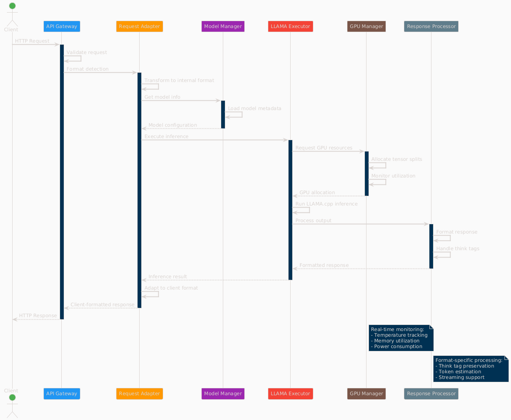

=== System Architecture

The LLM Inference Service follows a modular architecture with clear separation of concerns:

=== Core Components

.System Architecture Overview
image::../images/architecture-overview.png[Architecture Overview,800,600]

The service is organized into distinct layers:

* **API Gateway Layer**: Handles incoming requests and routing
* **Request Processing**: Manages format adapters and request tracking
* **Inference Engine**: Core LLM execution with GPU management
* **Monitoring & Analytics**: Real-time monitoring and metrics collection
* **Utilities**: Supporting services for optimization and cost analysis

=== Component Interactions

.Data Flow Through System Components  

The request processing flow follows these key stages:

1. **Client Request**: Incoming HTTP request in various API formats
2. **API Gateway**: Routes and validates requests
3. **Format Adaptation**: Converts to internal format
4. **Model Management**: Loads model metadata and validates parameters
5. **GPU Allocation**: Distributes workload across available GPUs
6. **Inference Execution**: Runs LLAMA.cpp with tensor splitting
7. **Response Processing**: Formats output for client requirements

=== Deployment Architecture

.Production Deployment Architecture
image::../images/deployment-architecture.png[Deployment Architecture,800,600]

The deployment follows a production-ready pattern:

* **SystemD Service Management**: Auto-restart and lifecycle management
* **Multi-GPU Configuration**: 4x Tesla M10 GPUs with equal tensor splits
* **Persistent Storage**: Model repository and configuration management
* **Network Security**: Firewall and load balancer integration
* **Client Access**: Support for web, API, and CLI interfaces

=== Technical Design Patterns

=== Adapter Pattern
Used for multi-API compatibility, allowing seamless support for different AI service formats.

=== Observer Pattern
Implemented in monitoring systems for real-time metric collection and alerting.

=== Strategy Pattern
Applied in model selection and execution strategies based on workload characteristics.

=== Factory Pattern
Used for creating appropriate adapters and executors based on request types.

=== Component Details

=== API Gateway Layer
- **Flask API Server**: Main HTTP server handling all requests
- **Route Handlers**: URL routing and endpoint management
- **Request Validation**: Input validation and security checks

=== Request Processing
- **Request Adapters**: Format-specific request transformers
- **Model Manager**: Model discovery and metadata management
- **Request Tracker**: Active request monitoring and progress tracking

=== Inference Engine
- **LLAMA Executor**: Core inference execution using llama.cpp
- **GPU Manager**: Multi-GPU resource allocation and monitoring
- **Response Processor**: Output formatting and post-processing

=== Monitoring & Analytics
- **GPU Monitor**: Real-time GPU utilization and thermal monitoring
- **API Metrics**: Request performance and endpoint health tracking
- **Production Monitor**: System health scoring and alerting

=== Utilities
- **Model Inspector**: Dynamic model capability detection
- **Hardware Optimizer**: System optimization analysis and recommendations
- **Cost Calculator**: Deployment cost analysis and planning