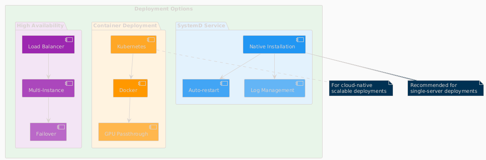

=== Overview

This guide covers deployment options for the LLM Inference Service in production environments.

=== System Requirements

=== Hardware Requirements

[cols="2,3,2", options="header"]
|===
|Component |Minimum |Recommended

|CPU
|8 cores, x86_64
|32+ cores, Intel Xeon or AMD EPYC

|Memory
|32GB RAM
|256GB+ ECC RAM

|GPU
|1x NVIDIA GPU (8GB VRAM)
|4x NVIDIA GPUs (24GB+ VRAM each)

|Storage
|500GB SSD
|2TB+ NVMe SSD

|Network
|1 Gbps
|10 Gbps
|===

=== Software Requirements

* Ubuntu 20.04+ or RHEL 8+
* Python 3.10+
* NVIDIA Driver 525+
* CUDA 11.8+
* Docker 20.10+ (optional)
* SystemD (for service deployment)

=== Deployment Architecture

.Deployment Options Overview

The service supports multiple deployment patterns:

* **SystemD Service**: Native installation with automatic lifecycle management
* **Container Deployment**: Docker-based deployment with GPU passthrough
* **High Availability**: Multi-instance setup with load balancing
* **Cloud-Native**: Kubernetes deployment for scalable cloud environments

=== SystemD Service Deployment

=== Installation Steps

1. **Clone the repository**:
[source,bash]
----
git clone https://github.com/your-org/llm-inference-service.git
cd llm-inference-service
----

2. **Install dependencies**:
[source,bash]
----
# System dependencies
sudo apt-get update
sudo apt-get install -y python3-pip python3-venv nvidia-driver-535

# Python environment
python3 -m venv venv
source venv/bin/activate
pip install -r requirements.txt
----

3. **Build llama.cpp**:
[source,bash]
----
cd /opt/llm/models/ollama-custom-models
git clone https://github.com/ggerganov/llama.cpp
cd llama.cpp
mkdir build && cd build
cmake .. -DLLAMA_CUDA=ON
make -j$(nproc)
----

4. **Configure the service**:
[source,bash]
----
# Copy and edit configuration
cp config/service_config.example.yaml config/service_config.yaml
vim config/service_config.yaml
----

5. **Install SystemD service**:
[source,bash]
----
# For system-wide installation
sudo ./install-service.sh

# For user-level installation
./install-user-service.sh
----

6. **Start the service**:
[source,bash]
----
# System service
sudo systemctl start llm-inference
sudo systemctl enable llm-inference

# User service
systemctl --user start llm-inference
systemctl --user enable llm-inference
----

=== Service Configuration

[source,yaml]
----
# /opt/llm/inference-service/config/service_config.yaml
models_dir: /opt/llm/models/ollama/models/blobs
manifests_dir: /opt/llm/models/ollama/models/manifests
llama_cpp_path: /opt/llm/models/ollama-custom-models/llama.cpp
default_context_size: 131072
tensor_split: '0.25,0.25,0.25,0.25'  # For 4 GPUs
gpu_layers: 999
threads: 32
batch_size: 512
request_timeout: 1800
log_level: INFO
enable_model_inspection: true
preserve_think_tags: true
----

=== Service Management

[source,bash]
----
# Check status
systemctl --user status llm-inference

# View logs
journalctl --user -u llm-inference -f

# Restart service
systemctl --user restart llm-inference

# Stop service
systemctl --user stop llm-inference
----

=== Docker Deployment

=== Building the Image

[source,dockerfile]
----
# Dockerfile
FROM nvidia/cuda:12.2.0-runtime-ubuntu22.04

# Install dependencies
RUN apt-get update && apt-get install -y \
    python3.10 \
    python3-pip \
    git \
    cmake \
    build-essential \
    && rm -rf /var/lib/apt/lists/*

# Set working directory
WORKDIR /app

# Copy application
COPY . .

# Install Python dependencies
RUN pip3 install --no-cache-dir -r requirements.txt

# Build llama.cpp
RUN cd /opt && \
    git clone https://github.com/ggerganov/llama.cpp && \
    cd llama.cpp && \
    mkdir build && cd build && \
    cmake .. -DLLAMA_CUDA=ON && \
    make -j$(nproc)

# Expose port
EXPOSE 11435

# Run the service
CMD ["python3", "-m", "ollama_server.main", "--port", "11435"]
----

=== Docker Compose

[source,yaml]
----
version: '3.8'

services:
  llm-inference:
    build: .
    image: llm-inference:latest
    container_name: llm-inference
    ports:
      - "11435:11435"
    volumes:
      - /opt/llm/models:/opt/llm/models
      - ./config:/app/config
      - ./logs:/app/logs
    environment:
      - NVIDIA_VISIBLE_DEVICES=all
      - CUDA_VISIBLE_DEVICES=0,1,2,3
    deploy:
      resources:
        reservations:
          devices:
            - driver: nvidia
              count: all
              capabilities: [gpu]
    restart: unless-stopped
----

=== Running with Docker

[source,bash]
----
# Build the image
docker-compose build

# Start the service
docker-compose up -d

# View logs
docker-compose logs -f

# Stop the service
docker-compose down
----

=== High Availability Setup

.High Availability Architecture
image::../images/ha-architecture.png[HA Architecture,800,600]

=== HAProxy Configuration

[source,conf]
----
global
    maxconn 4096
    log stdout local0

defaults
    mode http
    timeout connect 5s
    timeout client 30s
    timeout server 30s
    option httplog

frontend llm_frontend
    bind *:80
    default_backend llm_backend

backend llm_backend
    balance roundrobin
    option httpchk GET /health
    
    server llm1 192.168.1.10:11435 check
    server llm2 192.168.1.11:11435 check
----

=== Load Balancer Setup

**Features:**
* Round-robin load balancing with health checks
* Automatic failover for failed instances
* Session persistence for streaming requests
* Real-time monitoring and metrics

**Health Check Configuration:**
* Endpoint: `/health`
* Interval: 30 seconds
* Timeout: 5 seconds
* Failure threshold: 3 consecutive failures

=== Security Considerations

=== Network Security

1. **Firewall Rules**:
[source,bash]
----
# Allow only necessary ports
sudo ufw allow 22/tcp     # SSH
sudo ufw allow 11435/tcp  # LLM Service
sudo ufw enable
----

2. **SSL/TLS Configuration**:
[source,nginx]
----
server {
    listen 443 ssl http2;
    server_name llm.example.com;
    
    ssl_certificate /etc/ssl/certs/llm.crt;
    ssl_certificate_key /etc/ssl/private/llm.key;
    
    location / {
        proxy_pass http://localhost:11435;
        proxy_set_header Host $host;
        proxy_set_header X-Real-IP $remote_addr;
    }
}
----

=== Authentication

Implement authentication middleware:

[source,python]
----
from functools import wraps
from flask import request, jsonify

def require_api_key(f):
    @wraps(f)
    def decorated_function(*args, **kwargs):
        api_key = request.headers.get('X-API-Key')
        if not api_key or not validate_api_key(api_key):
            return jsonify({'error': 'Invalid API key'}), 401
        return f(*args, **kwargs)
    return decorated_function
----

=== Monitoring Setup

=== Prometheus Configuration

[source,yaml]
----
# prometheus.yml
global:
  scrape_interval: 15s

scrape_configs:
  - job_name: 'llm-inference'
    static_configs:
      - targets: ['localhost:11435']
    metrics_path: '/metrics'
----

=== Grafana Dashboard

Import the provided dashboard JSON from `monitoring/grafana-dashboard.json` for:

* GPU utilization and temperature
* Request latency and throughput
* Model performance metrics
* System resource usage

=== Backup and Recovery

=== Backup Strategy

[source,bash]
----
#!/bin/bash
# backup.sh

BACKUP_DIR="/backup/llm-inference"
DATE=$(date +%Y%m%d_%H%M%S)

# Backup configuration
cp -r /opt/llm/inference-service/config $BACKUP_DIR/config_$DATE

# Backup logs
tar -czf $BACKUP_DIR/logs_$DATE.tar.gz /opt/llm/inference-service/logs

# Backup model metadata (not the models themselves)
cp -r /opt/llm/models/ollama/models/manifests $BACKUP_DIR/manifests_$DATE

echo "Backup completed: $BACKUP_DIR/*_$DATE"
----

=== Recovery Procedure

1. Restore configuration files
2. Restart the service
3. Verify model availability
4. Test API endpoints

=== Troubleshooting

=== Common Issues

[cols="2,3,3", options="header"]
|===
|Issue |Cause |Solution

|Service won't start
|Missing dependencies
|Check logs with `journalctl --user -u llm-inference -n 100`

|GPU not detected
|Driver issues
|Verify with `nvidia-smi` and reinstall drivers if needed

|High memory usage
|Large context windows
|Adjust `default_context_size` in configuration

|Slow inference
|CPU-only mode
|Check `gpu_layers` setting and GPU availability

|Model not found
|Incorrect path
|Verify `models_dir` in configuration
|===

=== Debug Mode

Enable debug logging:

[source,bash]
----
# Edit service config
log_level: DEBUG

# Or run manually
python -m ollama_server.main --debug --port 11435
----

=== Performance Tuning

=== GPU Optimization

[source,yaml]
----
# Optimal settings for 4x Tesla M10
tensor_split: '0.25,0.25,0.25,0.25'
gpu_layers: 999
batch_size: 512
----

=== Context Management

[source,yaml]
----
# Balance between capability and memory
default_context_size: 32768  # For limited VRAM
# default_context_size: 131072  # For ample VRAM
----

=== Request Handling

[source,yaml]
----
# Concurrent request tuning
request_timeout: 1800
max_concurrent_requests: 10  # Adjust based on GPU memory
----

=== Production Checklist

=== Pre-Deployment
- [ ] Hardware requirements verified
- [ ] Dependencies installed and tested
- [ ] Configuration file reviewed and customized
- [ ] SSL certificates configured (if applicable)
- [ ] Firewall rules implemented
- [ ] Backup strategy defined

=== Post-Deployment
- [ ] Service health check passing
- [ ] GPU monitoring active
- [ ] API endpoints responsive
- [ ] Dashboard accessible
- [ ] Logging configuration verified
- [ ] Monitoring alerts configured
- [ ] Performance benchmarks established

=== Ongoing Maintenance
- [ ] Regular log rotation
- [ ] Performance monitoring
- [ ] Security updates
- [ ] Configuration backups
- [ ] Capacity planning reviews