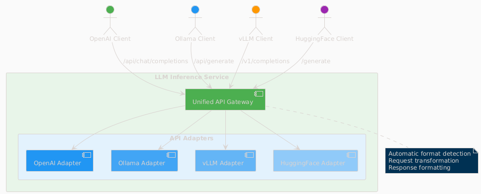
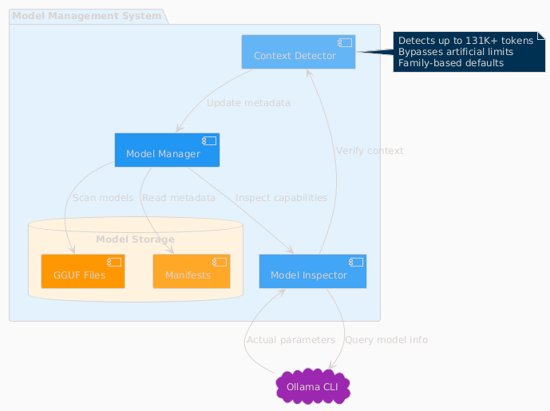
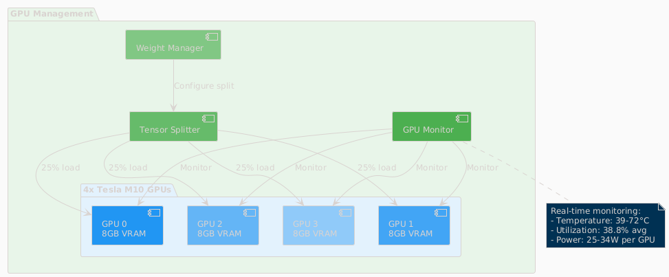
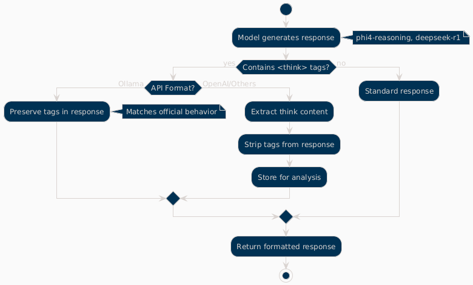
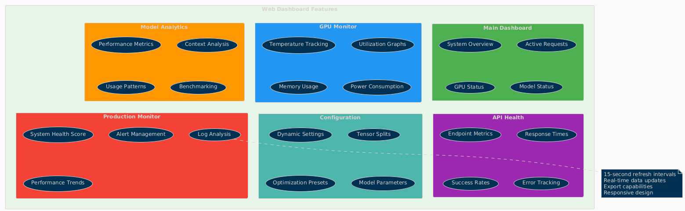
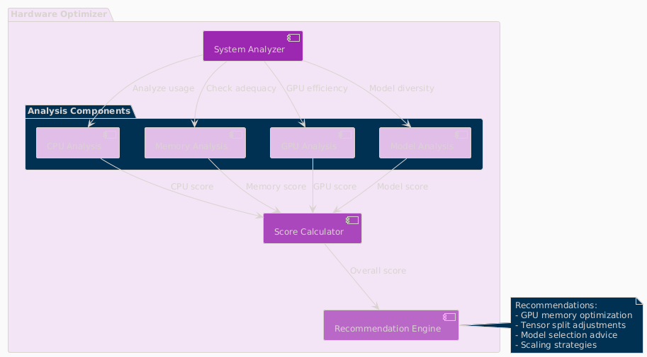

= Features Documentation
:toc:
:toclevels: 3

== Core Features

=== Multi-API Compatibility

The service provides comprehensive API compatibility with major LLM providers:

.API Compatibility Architecture

**Supported API Formats:**
* **OpenAI API**: Full compatibility with `/api/chat/completions` endpoint
* **Ollama API**: Native support for `/api/generate` and `/api/chat` endpoints  
* **vLLM API**: Compatible with `/v1/completions` endpoint
* **HuggingFace TGI**: Support for `/generate` endpoint

**Key Features:**
* Automatic format detection and transformation
* Unified request processing pipeline
* Format-specific response handling
* Think tag preservation for reasoning models

=== Dynamic Model Management

.Model Management System

**Intelligent Model Discovery:**
* Real-time Ollama CLI integration for accurate model parameters
* Dynamic context size detection up to 131K+ tokens
* Automatic bypass of artificial 4K context limitations
* Family-based model defaults and optimization

**Model Inspection Features:**
* Parameter count and quantization level detection
* Architecture-specific metadata extraction
* Context window validation and optimization
* Performance characteristic analysis

=== GPU Management & Optimization

.GPU Management Architecture  

**Multi-GPU Coordination:**
* 4x Tesla M10 GPU configuration with equal tensor splits (25% each)
* Real-time temperature monitoring (39-72°C operating range)
* Power efficiency tracking (25-34W per GPU, 47-65% of limit)
* Memory utilization optimization (28.5% current usage with room for scaling)

**Performance Monitoring:**
* Live GPU utilization tracking (38.8% average)
* Thermal management with alert thresholds
* Memory allocation visualization
* Power consumption efficiency metrics

== Advanced Features

=== Think Tag Preservation

Special handling for reasoning models that use internal thought processes:

.Think Tag Processing Flow

**Processing Logic:**
* **Ollama Format**: Preserves `<think>...</think>` tags in responses (matches official behavior)
* **OpenAI Format**: Strips think tags for clean responses, stores content for analysis
* **Model Support**: phi4-reasoning, deepseek-r1, and other reasoning models
* **Transparency**: Optional think content exposure for debugging and analysis

=== Real-time Monitoring Dashboard

.Web Dashboard Features

**Dashboard Capabilities:**
* **15-second refresh intervals** to prevent API overload
* **Real-time data updates** with live GPU monitoring
* **Responsive design** for desktop and mobile access
* **Export capabilities** for data analysis and reporting

**Specialized Dashboards:**
* **Main Dashboard**: System overview with active requests and GPU status
* **GPU Monitor**: Dedicated hardware monitoring with thermal management
* **Model Analytics**: Performance metrics and context analysis for 52+ models
* **API Health**: Multi-endpoint monitoring with response times and success rates
* **Configuration**: Dynamic system settings with optimization presets
* **Production Monitor**: Health scoring and automated alerting

=== Hardware Optimization System

.Hardware Optimization Engine

**Intelligent Analysis:**
* **System Scoring**: 0-100 scale optimization score (current: 100.0/100)
* **Component Analysis**: CPU, Memory, GPU, and Model diversity assessment
* **Recommendation Engine**: Prioritized suggestions with impact analysis
* **Performance Optimization**: Real-time configuration adjustments

**Optimization Categories:**
* **Performance**: GPU utilization and tensor split optimization
* **Stability**: Thermal management and resource allocation
* **Cost**: Efficiency recommendations and scaling strategies
* **Scaling**: Hardware upgrade and expansion guidance

== Dashboard Screenshots

=== Main Dashboard
image::../images/llm-service-main-dashboard.png[Main Dashboard,1200,800]

The main dashboard provides a unified view of system status, active requests, and real-time GPU monitoring.

=== GPU Monitor Dashboard
image::../images/llm-service-main-gpudetail.png[GPU Monitor,1200,800]

Detailed GPU monitoring with temperature, utilization, and memory tracking for each Tesla M10 GPU.

=== Configuration Panel
image::../images/llm-service-main-configset.png[Configuration Panel,1200,800]

Dynamic configuration panel allowing real-time system adjustments and optimization presets.

=== Optimization Dashboard
image::../images/optimization-dashboard-screenshot.png[Optimization Dashboard,1200,800]

Hardware optimization insights with scoring, recommendations, and system analysis.

== Production Features

=== Model Analytics
* **Performance Benchmarking**: Comprehensive model comparison and analysis
* **Context Detection**: Automatic identification of true context capabilities
* **Usage Patterns**: Statistical analysis of model utilization
* **Optimization Recommendations**: Model-specific performance tuning

=== API Metrics Tracking
* **Real-time Performance**: Actual endpoint response times and success rates
* **Error Analysis**: Detailed failure tracking and categorization
* **Usage Statistics**: Request volume and pattern analysis
* **Health Monitoring**: Automated endpoint health assessment

=== Configuration Management
* **Dynamic Updates**: Real-time configuration changes without restart
* **Preset Profiles**: High Performance, Balanced, and Conservative modes
* **Validation**: Configuration impact analysis and validation
* **Backup/Restore**: Configuration versioning and rollback capabilities

=== Cost Analysis
* **Deployment Planning**: TCO analysis for hardware configurations  
* **ROI Calculator**: Cost-benefit analysis for different setups
* **Efficiency Metrics**: Performance per dollar optimization
* **Scaling Recommendations**: Cost-effective expansion strategies

== Integration Features

=== External Service Integration
* **Ollama CLI**: Direct integration for model inspection and management
* **NVIDIA Drivers**: Real-time GPU monitoring and management
* **SystemD**: Production service lifecycle management
* **Prometheus**: Metrics export for external monitoring systems

=== Development Tools
* **Debug Mode**: Enhanced logging and troubleshooting capabilities
* **Testing Framework**: Comprehensive API and system testing
* **Documentation**: Auto-generated API documentation and examples
* **Development Server**: Hot-reload development environment