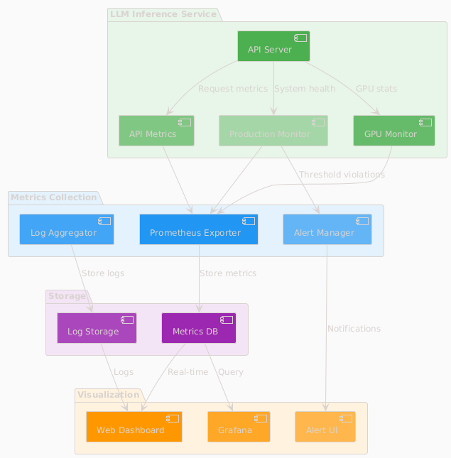
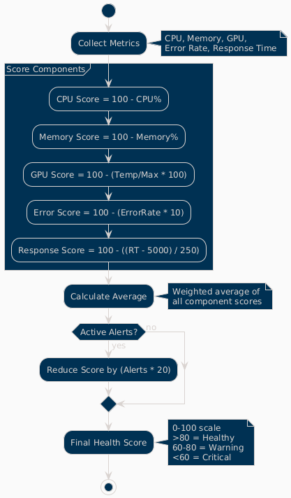
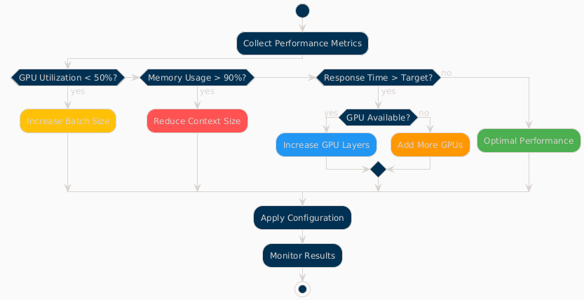

=== Overview

The LLM Inference Service provides comprehensive monitoring capabilities for production deployments.

=== Monitoring Architecture

.Monitoring System Architecture

The monitoring system consists of:

* **LLM Inference Service**: Core service with integrated metrics collection
* **Metrics Collection**: Prometheus exporters and log aggregation
* **Visualization**: Web dashboards and Grafana integration
* **Storage**: Time-series database for metrics and log storage
* **Alerting**: Automated alert management and notifications

=== Web Dashboard

=== Dashboard Overview

The service includes a comprehensive web dashboard accessible at `http://localhost:11435/dashboard`.

.Dashboard Pages Architecture
image::../images/dashboard-pages.png[Dashboard Pages,700,500]

**Dashboard Features:**
* **15-second auto-refresh** to prevent API overload
* **Real-time data updates** with live GPU monitoring
* **Responsive design** for desktop and mobile access
* **Export capabilities** for data analysis and reporting

=== Key Metrics Tracked

[cols="2,3,2", options="header"]
|===
|Metric |Description |Update Frequency

|GPU Temperature
|Per-GPU temperature in Celsius
|Real-time (1s)

|GPU Utilization
|Percentage of GPU compute usage
|Real-time (1s)

|Memory Usage
|VRAM usage per GPU in MB
|Real-time (1s)

|Request Latency
|End-to-end request processing time
|Per request

|Token Generation Rate
|Tokens per second during inference
|Per request

|API Success Rate
|Percentage of successful requests
|1 minute window

|System Health Score
|0-100 composite health indicator
|1 minute

|Active Alerts
|Current unresolved system alerts
|Real-time
|===

=== Production Monitoring

=== Health Score Calculation

.Health Score Calculation Flow

**Scoring Components:**
* **CPU Score**: 100 - CPU utilization percentage
* **Memory Score**: 100 - Memory utilization percentage  
* **GPU Score**: 100 - (Temperature/Max × 100)
* **Error Score**: 100 - (Error rate × 10)
* **Response Score**: 100 - ((Response time - 5000) / 250)

**Final Calculation:**
* Weighted average of all component scores
* Penalty reduction for active alerts (20 points per alert)
* Scale: 0-100 (>80 = Healthy, 60-80 = Warning, <60 = Critical)

=== Alert Configuration

Configure alerts in the Production Monitor dashboard:

[source,yaml]
----
# Alert thresholds
alerts:
  cpu_usage:
    warning: 80    # percentage
    critical: 95
    duration: 300  # seconds
    
  memory_usage:
    warning: 85
    critical: 95
    duration: 300
    
  gpu_temperature:
    warning: 80    # Celsius
    critical: 85
    duration: 180
    
  error_rate:
    warning: 5     # percentage
    critical: 15
    duration: 120
    
  response_time:
    warning: 10000 # milliseconds
    critical: 30000
    duration: 180
----

=== Alert Types

.Alert Processing Flow
image::../images/alert-flow.png[Alert Flow,600,500]

**Alert Lifecycle:**
1. **Metric Collection**: Continuous monitoring of system metrics
2. **Threshold Evaluation**: Check against warning and critical thresholds
3. **Duration Timer**: Prevent false positives with sustained threshold violations
4. **Alert Creation**: Generate warning or critical alerts based on severity
5. **Notification**: Send alerts via dashboard, logs, email, or webhooks
6. **Resolution**: Automatic resolution when metrics return to normal

## GPU Monitoring

=== Metrics Collected

[source,json]
----
{
  "timestamp": "2025-06-07T20:30:00Z",
  "gpus": [
    {
      "index": 0,
      "name": "Tesla M10",
      "temperature": 45,
      "utilization_percent": 35.5,
      "memory_used": 2280,
      "memory_total": 8192,
      "memory_percent": 27.8,
      "power_draw": 30,
      "power_limit": 225,
      "fan_speed": 40
    }
  ],
  "total_memory_used": 9120,
  "total_memory_available": 32768,
  "average_temperature": 48.5,
  "average_utilization": 38.8,
  "thermal_status": "good"
}
----

=== Thermal Management

[cols="2,2,3", options="header"]
|===
|Temperature Range |Status |Action

|< 70°C
|Good
|Normal operation

|70-80°C
|Warning
|Monitor closely, check cooling

|80-85°C
|Critical
|Reduce workload, check fans

|> 85°C
|Emergency
|Throttle or shutdown
|===

=== API Monitoring

=== Endpoint Metrics

Track performance for each API endpoint:

[source,json]
----
{
  "endpoints": [
    {
      "endpoint": "OpenAI API",
      "path": "/api/chat/completions",
      "total_requests": 1527,
      "successful_requests": 1520,
      "failed_requests": 7,
      "average_response_time": 245.3,
      "success_rate": 99.5,
      "last_request_time": "2025-06-07T20:29:45Z",
      "status": "healthy"
    }
  ],
  "timestamp": "2025-06-07T20:30:00Z",
  "overallHealth": "healthy"
}
----

=== Performance Tracking

.Performance Tracking Flow
image::../images/performance-tracking.png[Performance Tracking,700,500]

**Tracking Process:**
1. **Request Initiation**: Client sends request to API gateway
2. **Timer Start**: Metrics collector starts response time measurement
3. **Request Processing**: API processes request through inference pipeline
4. **Metrics Calculation**: Calculate response time, success/failure, token count
5. **Dashboard Update**: Real-time dashboard updates with latest metrics

=== Log Management

=== Log Structure

[source,json]
----
{
  "timestamp": "2025-06-07T20:30:00.123Z",
  "level": "INFO",
  "logger": "ollama_server.api.handlers",
  "request_id": "7b4fa8e5-e2a9-4410-b43c-d071c8323fe1",
  "message": "Handling non-streaming request",
  "extra": {
    "api": "openai",
    "model": "phi4:latest",
    "endpoint": "/api/chat/completions",
    "remote_addr": "192.168.1.100"
  }
}
----

=== Log Levels

[cols="1,3,2", options="header"]
|===
|Level |Usage |Example

|ERROR
|System errors, failures
|Model loading failed

|WARNING
|Performance issues, alerts
|High GPU temperature

|INFO
|Normal operations
|Request completed

|DEBUG
|Detailed troubleshooting
|Token generation details
|===

=== Log Rotation

Configure log rotation in `/etc/logrotate.d/llm-inference`:

[source,conf]
----
/opt/llm/inference-service/logs/*.log {
    daily
    rotate 14
    compress
    delaycompress
    missingok
    notifempty
    create 0640 llm llm
    sharedscripts
    postrotate
        systemctl reload llm-inference
    endscript
}
----

=== Performance Optimization

=== Monitoring-Based Optimization

.Optimization Decision Flow

**Optimization Logic:**
* **Low GPU Utilization (<50%)**: Increase batch size for better throughput
* **High Memory Usage (>90%)**: Reduce context size to prevent OOM errors
* **High Response Time**: Increase GPU layers or add more GPUs
* **Optimal Performance**: Maintain current configuration

=== Key Performance Indicators

1. **Throughput**: Tokens per second
2. **Latency**: 95th percentile response time
3. **Efficiency**: GPU utilization percentage
4. **Reliability**: Success rate percentage
5. **Scalability**: Concurrent request capacity

=== Alerting Integration

=== Webhook Configuration

[source,python]
----
# config/alerting.yaml
alerting:
  webhooks:
    - url: "https://hooks.slack.com/services/YOUR/WEBHOOK/URL"
      events: ["critical", "warning"]
      
    - url: "https://api.pagerduty.com/incidents"
      events: ["critical"]
      headers:
        Authorization: "Token token=YOUR_TOKEN"
----

=== Email Alerts

[source,yaml]
----
email:
  smtp_server: "smtp.gmail.com"
  smtp_port: 587
  use_tls: true
  username: "alerts@example.com"
  recipients:
    - "ops-team@example.com"
    - "on-call@example.com"
----

=== Grafana Integration

=== Prometheus Metrics Export

The service exposes Prometheus-compatible metrics at `/metrics`:

[source,prometheus]
----
# HELP llm_request_duration_seconds Request duration
# TYPE llm_request_duration_seconds histogram
llm_request_duration_seconds_bucket{api="openai",model="phi4",le="0.1"} 245
llm_request_duration_seconds_bucket{api="openai",model="phi4",le="0.5"} 1203

# HELP llm_gpu_temperature_celsius GPU temperature
# TYPE llm_gpu_temperature_celsius gauge
llm_gpu_temperature_celsius{gpu="0",name="Tesla M10"} 45

# HELP llm_active_requests Number of active requests
# TYPE llm_active_requests gauge
llm_active_requests 3
----

=== Sample Grafana Dashboard

Import `monitoring/grafana-dashboard.json` for pre-configured panels:

* Request rate and latency
* GPU utilization heatmap
* Model performance comparison
* System resource usage
* Alert history

=== Troubleshooting with Monitoring

=== Performance Issues

1. Check GPU utilization in dashboard
2. Review response time trends
3. Analyze error logs
4. Verify resource allocation

=== Common Patterns

[cols="2,3,3", options="header"]
|===
|Pattern |Likely Cause |Investigation

|Increasing latency
|Memory pressure, thermal throttling
|Check GPU temperature and VRAM usage

|Error rate spikes
|Model issues, OOM errors
|Review error logs and GPU memory

|Low GPU utilization
|CPU bottleneck, small batch size
|Increase batch size, check CPU usage

|Intermittent failures
|Resource contention, driver issues
|Check system logs and dmesg
|===

=== Monitoring Best Practices

=== Dashboard Usage
* Monitor main dashboard for system overview
* Use specialized dashboards for detailed analysis
* Set up automated alerts for critical metrics
* Export data for trend analysis and capacity planning

=== Alert Configuration
* Set appropriate warning and critical thresholds
* Use duration-based triggering to prevent false positives
* Configure multiple notification channels for redundancy
* Regular review and tuning of alert thresholds

=== Performance Monitoring
* Establish baseline performance metrics
* Monitor trends for capacity planning
* Use optimization insights for system tuning
* Regular performance reviews and adjustments

=== Log Analysis
* Configure appropriate log levels for environment
* Implement log rotation to manage disk space
* Use structured logging for better analysis
* Regular log review for security and performance insights